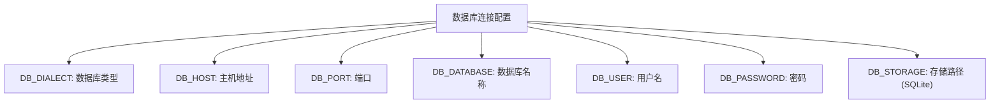
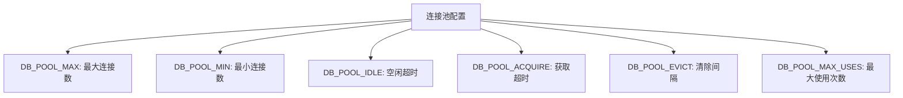
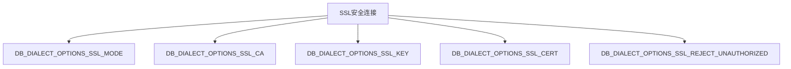
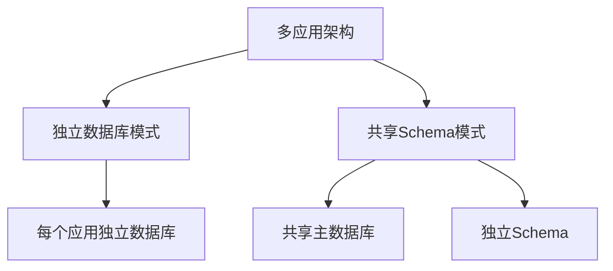
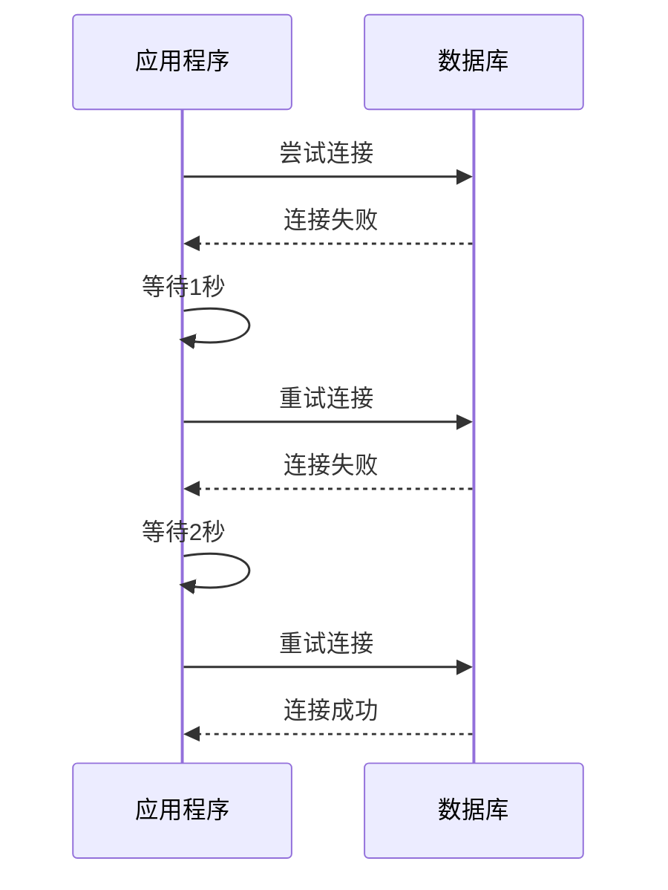
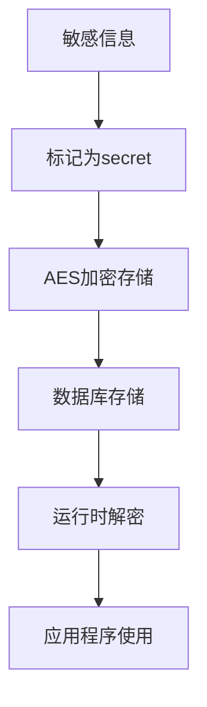
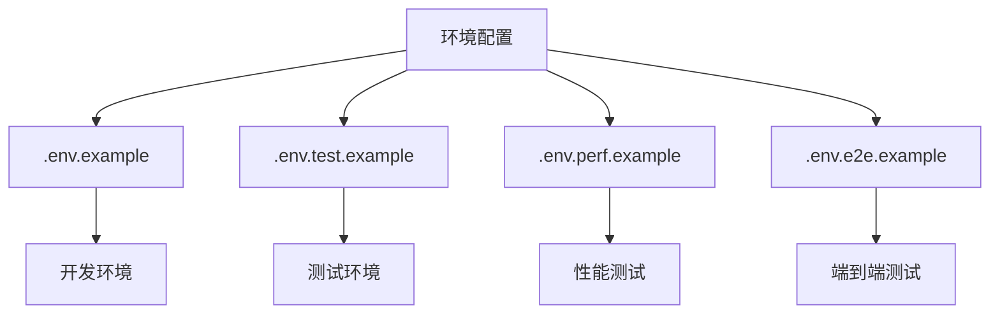

# 数据库环境变量

<cite>
**本文档中引用的文件**  
- [.env.example](file://.env.example)
- [.env.test.example](file://.env.test.example)
- [packages/core/database/src/helpers.ts](file://packages/core/database/src/helpers.ts)
- [packages/core/database/src/database.ts](file://packages/core/database/src/database.ts)
- [packages/plugins/@nocobase/plugin-multi-app-manager/src/server/server.ts](file://packages/plugins/@nocobase/plugin-multi-app-manager/src/server/server.ts)
- [packages/plugins/@nocobase/plugin-environment-variables/src/server/plugin.ts](file://packages/plugins/@nocobase/plugin-environment-variables/src/server/plugin.ts)
- [packages/core/server/src/environment.ts](file://packages/core/server/src/environment.ts)
</cite>

## 目录
1. [简介](#简介)
2. [核心数据库环境变量](#核心数据库环境变量)
3. [连接池配置](#连接池配置)
4. [SSL安全连接配置](#ssl安全连接配置)
5. [多数据库与多应用配置](#多数据库与多应用配置)
6. [连接超时与重试机制](#连接超时与重试机制)
7. [敏感信息安全存储](#敏感信息安全存储)
8. [不同环境的配置策略](#不同环境的配置策略)
9. [总结](#总结)

## 简介

NocoBase通过环境变量提供灵活的数据库配置方式，支持多种数据库类型（如PostgreSQL、MySQL、MariaDB、Kingbase等）和复杂的部署场景。本文档详细说明了所有与数据库连接相关的环境变量，包括基本连接参数、连接池配置、SSL安全连接、多数据库支持以及敏感信息的安全存储策略。

**Section sources**
- [.env.example](file://.env.example)
- [.env.test.example](file://.env.test.example)

## 核心数据库环境变量

NocoBase使用一系列环境变量来配置数据库连接。这些变量定义了数据库的基本连接信息，是系统正常运行的前提。

### 基本连接参数

以下环境变量用于定义数据库的基本连接信息：

- **DB_DIALECT**: 数据库类型，支持 `postgres`、`mysql`、`mariadb`、`kingbase` 等。
- **DB_HOST**: 数据库服务器主机地址，默认为 `localhost`。
- **DB_PORT**: 数据库服务器端口，PostgreSQL默认为 `5432`，MySQL/MariaDB默认为 `3306`。
- **DB_DATABASE**: 要连接的数据库名称。
- **DB_USER**: 数据库用户名。
- **DB_PASSWORD**: 数据库密码。
- **DB_STORAGE**: 用于SQLite数据库的存储路径，如 `storage/db/nocobase.sqlite`。

**Diagram sources**
- [.env.example](file://.env.example#L48-L55)
- [packages/core/database/src/helpers.ts](file://packages/core/database/src/helpers.ts#L103-L107)

### 高级连接参数

除了基本连接参数外，NocoBase还支持以下高级配置：

- **DB_LOGGING**: 是否启用SQL日志记录，设置为 `on` 启用。
- **DB_UNDERSCORED**: 是否使用下划线命名法，设置为 `true` 启用。
- **DB_TABLE_PREFIX**: 数据库表前缀，用于区分不同应用的表。
- **DB_SCHEMA**: 数据库模式（Schema），主要用于PostgreSQL。
- **DB_TIMEZONE**: 数据库时区设置。

**Section sources**
- [.env.example](file://.env.example#L56-L58)
- [packages/core/database/src/helpers.ts](file://packages/core/database/src/helpers.ts#L110-L113)

## 连接池配置

NocoBase基于Sequelize的连接池机制，通过环境变量提供详细的连接池配置选项，以优化数据库性能和资源利用。

### 连接池参数

连接池配置允许您控制数据库连接的数量和行为：

- **DB_POOL_MAX**: 连接池中最大连接数，默认值由Sequelize决定。
- **DB_POOL_MIN**: 连接池中最小连接数。
- **DB_POOL_IDLE**: 连接在释放回池之前可以空闲的最长时间（毫秒）。
- **DB_POOL_ACQUIRE**: 获取连接的超时时间（毫秒）。
- **DB_POOL_EVICT**: 从池中清除连接的间隔时间（毫秒）。
- **DB_POOL_MAX_USES**: 单个连接的最大使用次数，设置为0表示无限制。

**Diagram sources**
- [packages/core/database/src/helpers.ts](file://packages/core/database/src/helpers.ts#L77-L97)

### 连接池工作原理

连接池通过复用数据库连接来提高性能。当应用程序需要数据库连接时，它从池中获取一个空闲连接；使用完毕后，连接被返回到池中而不是关闭。这种机制减少了创建和销毁连接的开销。

**Section sources**
- [packages/core/database/src/helpers.ts](file://packages/core/database/src/helpers.ts#L77-L97)

## SSL安全连接配置

为了确保数据库连接的安全性，NocoBase支持通过SSL/TLS加密连接。

### SSL配置参数

以下环境变量用于配置SSL连接：

- **DB_DIALECT_OPTIONS_SSL_MODE**: SSL模式。
- **DB_DIALECT_OPTIONS_SSL_CA**: CA证书路径或内容。
- **DB_DIALECT_OPTIONS_SSL_KEY**: 客户端密钥路径或内容。
- **DB_DIALECT_OPTIONS_SSL_CERT**: 客户端证书路径或内容。
- **DB_DIALECT_OPTIONS_SSL_REJECT_UNAUTHORIZED**: 是否拒绝未授权的连接，设置为 `true` 或 `false`。

**Diagram sources**
- [packages/core/database/src/helpers.ts](file://packages/core/database/src/helpers.ts#L57-L74)

### SSL配置实现

NocoBase通过 `extractSSLOptionsFromEnv` 函数从环境变量中提取SSL配置，并将其应用于数据库连接选项。系统支持直接提供证书内容或文件路径。

**Section sources**
- [packages/core/database/src/helpers.ts](file://packages/core/database/src/helpers.ts#L57-L74)

## 多数据库与多应用配置

NocoBase支持复杂的多数据库和多应用架构，允许在不同场景下使用不同的数据库配置。

### 多应用数据库策略

通过 `plugin-multi-app-manager` 插件，NocoBase支持两种多应用数据库策略：

1. **独立数据库模式**: 每个子应用使用独立的数据库。
2. **共享Schema模式**: 所有子应用共享主数据库，但使用不同的Schema。

**Diagram sources**
- [packages/plugins/@nocobase/plugin-multi-app-manager/src/server/server.ts](file://packages/plugins/@nocobase/plugin-multi-app-manager/src/server/server.ts#L124-L130)

### 配置实现

多应用数据库配置通过以下环境变量控制：
- **USE_DB_SCHEMA_IN_SUBAPP**: 设置为 `true` 启用共享Schema模式。
- 当启用共享Schema模式时，子应用的Schema名称设置为应用名称。

**Section sources**
- [packages/plugins/@nocobase/plugin-multi-app-manager/src/server/server.ts](file://packages/plugins/@nocobase/plugin-multi-app-manager/src/server/server.ts#L124-L130)

## 连接超时与重试机制

NocoBase实现了健壮的数据库连接重试机制，确保在临时网络问题或数据库启动延迟时仍能成功连接。

### 重试机制配置

系统使用指数退避算法进行连接重试：

- **初始延迟**: 1000毫秒
- **倍增因子**: 2
- **最大重试次数**: 10次
- **最大延迟**: 30秒

**Diagram sources**
- [packages/core/database/src/database.ts](file://packages/core/database/src/database.ts#L840-L873)

### 重试逻辑实现

重试机制通过 `exponential-backoff` 库实现，`auth` 方法会自动处理连接失败并按指数退避策略重试，最多尝试10次。

**Section sources**
- [packages/core/database/src/database.ts](file://packages/core/database/src/database.ts#L840-L873)

## 敏感信息安全存储

NocoBase提供多种机制来安全地存储和管理敏感信息，如数据库密码和加密密钥。

### 环境变量安全

通过 `plugin-environment-variables` 插件，NocoBase支持：

- **秘密变量类型**: 标记为 `secret` 的环境变量会被加密存储。
- **AES加密**: 使用AES算法对敏感信息进行加密。
- **运行时解密**: 在需要时动态解密敏感信息。

**Diagram sources**
- [packages/plugins/@nocobase/plugin-environment-variables/src/server/plugin.ts](file://packages/plugins/@nocobase/plugin-environment-variables/src/server/plugin.ts#L180-L183)

### 加密字段密钥

对于加密字段，需要设置 `ENCRYPTION_FIELD_KEY` 环境变量：
- 必须是32个字符的字符串
- 用于AES加密算法的密钥

**Section sources**
- [packages/plugins/@nocobase/plugin-environment-variables/src/server/plugin.ts](file://packages/plugins/@nocobase/plugin-environment-variables/src/server/plugin.ts#L180-L183)
- [packages/core/database/src/fields/encryption-field/utils.ts](file://packages/core/database/src/fields/encryption-field/utils.ts#L95-L104)

## 不同环境的配置策略

NocoBase为不同运行环境提供了专门的配置示例文件，便于在开发、测试和生产环境中使用不同的数据库配置。

### 环境配置文件

系统提供了多个示例配置文件：

- **.env.example**: 主配置文件，适用于开发环境。
- **.env.test.example**: 测试环境配置，使用SQLite内存数据库。
- **.env.perf.example**: 性能测试环境配置。
- **.env.e2e.example**: 端到端测试环境配置。

**Diagram sources**
- [.env.example](file://.env.example)
- [.env.test.example](file://.env.test.example)

### 测试环境特殊配置

测试环境使用SQLite内存数据库，具有以下特点：
- **DB_DIALECT=sqlite**: 使用SQLite数据库。
- **DB_STORAGE=:memory:**: 使用内存数据库，每次重启数据丢失。
- 适合快速、隔离的单元测试。

**Section sources**
- [.env.test.example](file://.env.test.example#L14-L15)

## 总结

NocoBase提供了全面而灵活的数据库环境变量配置系统，支持从基本连接到高级安全特性的各种需求。通过合理配置这些环境变量，可以在不同部署场景下优化数据库性能和安全性。

关键要点：
- 使用标准环境变量进行数据库连接配置
- 通过连接池参数优化性能
- 支持SSL加密连接确保数据安全
- 提供多数据库和多应用架构支持
- 实现健壮的连接重试机制
- 提供敏感信息的安全存储方案
- 为不同环境提供专门的配置策略

这些特性使得NocoBase能够适应从小型开发项目到大型生产部署的各种场景。

**Section sources**
- [.env.example](file://.env.example)
- [packages/core/database/src/helpers.ts](file://packages/core/database/src/helpers.ts)
- [packages/core/database/src/database.ts](file://packages/core/database/src/database.ts)