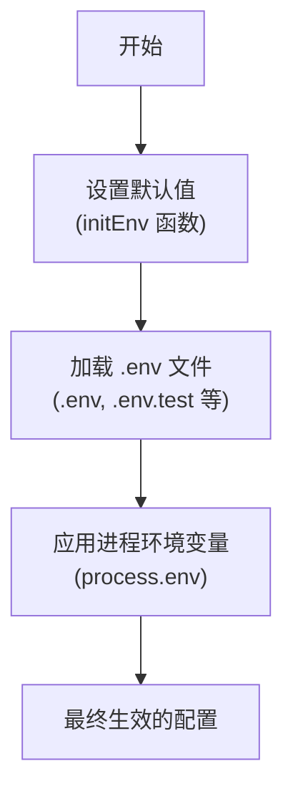
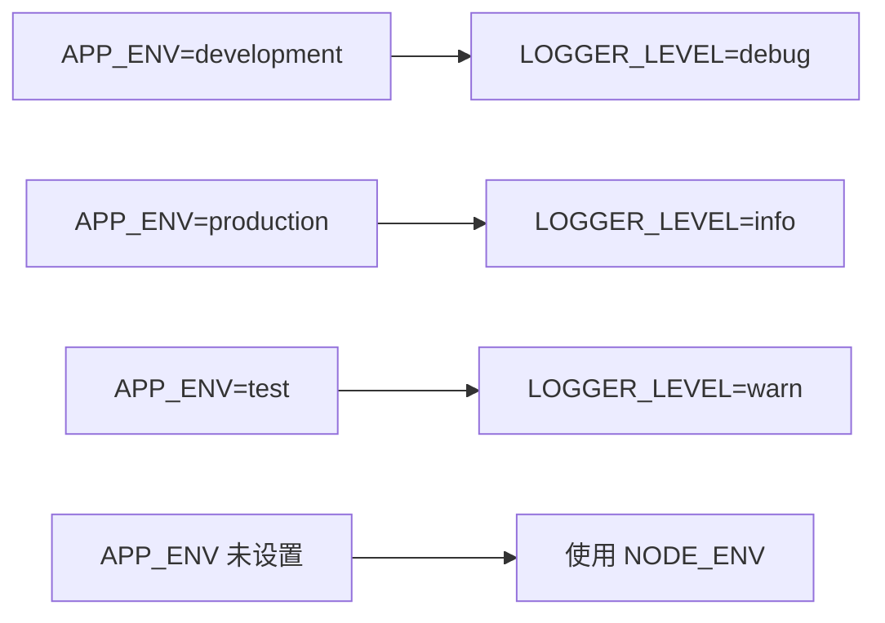
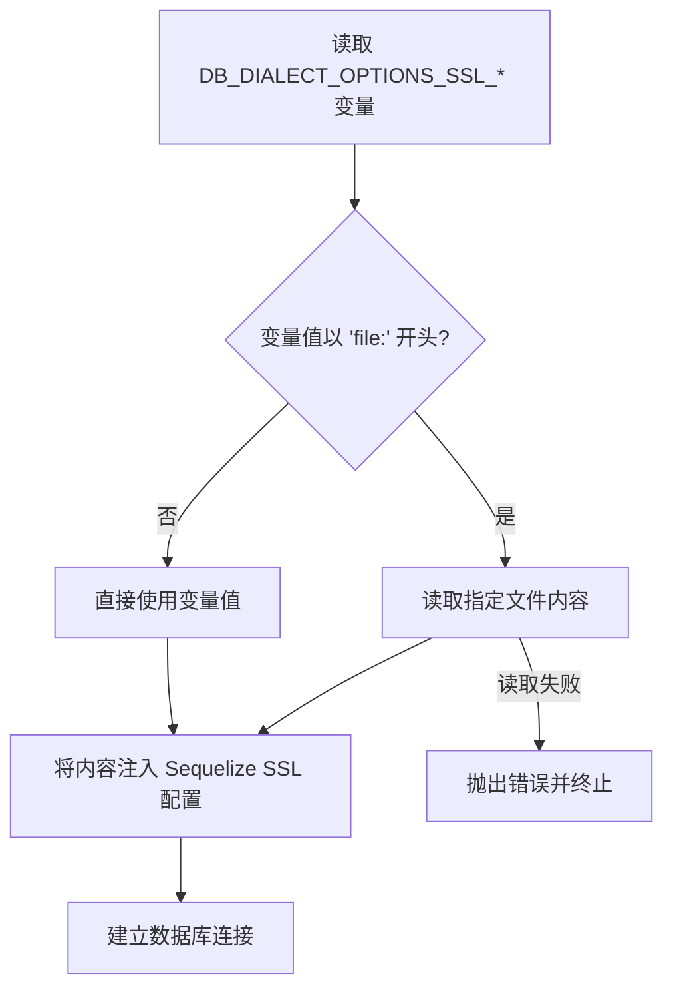
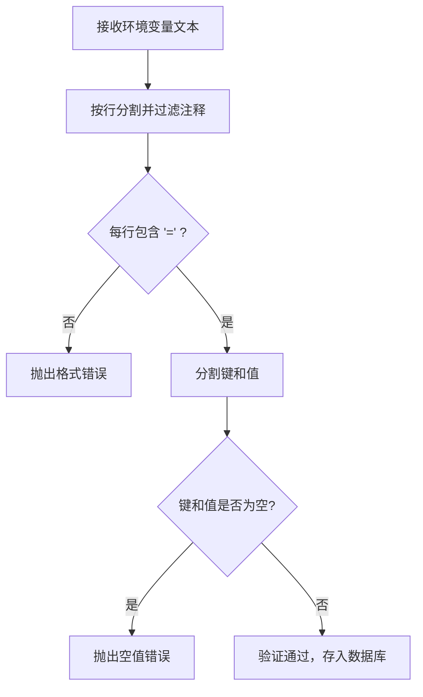
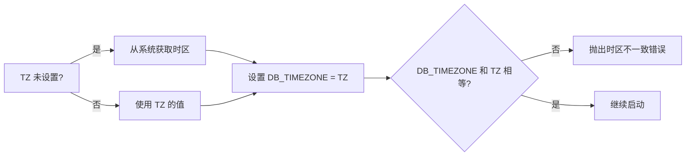

# 核心环境变量

<cite>
**本文档中引用的文件**  
- [.env.example](file://.env.example)
- [.env.test.example](file://.env.test.example)
- [packages/core/cli/src/util.js](file://packages/core/cli/src/util.js#L356-L474)
- [packages/core/server/src/environment.ts](file://packages/core/server/src/environment.ts#L1-L47)
- [packages/plugins/@nocobase/plugin-environment-variables/src/server/plugin.ts](file://packages/plugins/@nocobase/plugin-environment-variables/src/server/plugin.ts#L1-L219)
- [packages/core/database/src/helpers.ts](file://packages/core/database/src/helpers.ts#L57-L74)
- [packages/core/logger/src/config.ts](file://packages/core/logger/src/config.ts)
</cite>

## 目录
1. [简介](#简介)
2. [核心环境变量列表](#核心环境变量列表)
3. [变量加载机制与优先级](#变量加载机制与优先级)
4. [部署场景最佳实践](#部署场景最佳实践)
5. [变量验证与错误处理](#变量验证与错误处理)
6. [系统默认行为](#系统默认行为)

## 简介
NocoBase 是一个低代码开发平台，其运行行为通过一系列核心环境变量进行配置。这些环境变量控制着应用的运行模式、服务端口、日志级别、数据库连接、缓存策略等关键功能。本文档详细说明了这些核心环境变量的定义、默认值、可选范围、对系统行为的影响，以及在不同部署场景下的配置最佳实践。

**Section sources**
- [.env.example](file://.env.example#L1-L98)
- [.env.test.example](file://.env.test.example#L1-L77)

## 核心环境变量列表
NocoBase 的核心环境变量主要分为以下几类：应用配置、数据库配置、日志配置、缓存配置和初始化配置。

### 应用配置
这些变量定义了应用的基本运行参数。

| 变量名 | 默认值 | 可选值 | 说明 |
| :--- | :--- | :--- | :--- |
| `APP_ENV` | `development` | `development`, `production`, `test` | 应用运行环境。在 `production` 模式下，直接访问根路径会返回 "Not Found"，建议使用 Nginx 代理静态文件。 |
| `APP_PORT` | `13000` | 任意有效端口号 | 应用监听的 HTTP 端口。 |
| `APP_KEY` | `test-key` | 任意字符串 | 用于 JWT 签名的密钥，应设置为强随机字符串。 |
| `API_BASE_PATH` | `/api/` | 任意路径字符串 | API 接口的根路径。 |
| `WORKER_MODE` | (空) | `<EMPTY>`, `!`, `*`, `<topic1>,<topic2>`, `!,<topic2>` | 服务器运行模式，决定如何处理请求和后台任务。 |

**Section sources**
- [.env.example](file://.env.example#L13-L15)
- [.env.example](file://.env.example#L17-L18)
- [.env.example](file://.env.example#L38-L44)

### 数据库配置
这些变量用于配置与数据库的连接。

| 变量名 | 默认值 | 可选值 | 说明 |
| :--- | :--- | :--- | :--- |
| `DB_DIALECT` | `postgres` | `postgres`, `mysql`, `mariadb`, `kingbase` | 数据库类型。 |
| `DB_HOST` | `localhost` | 有效的主机名或 IP 地址 | 数据库服务器地址。 |
| `DB_PORT` | `5432` | 任意有效端口号 | 数据库服务器端口。 |
| `DB_DATABASE` | `nocobase` | 任意数据库名 | 要连接的数据库名称。 |
| `DB_USER` | `nocobase` | 任意用户名 | 数据库用户名。 |
| `DB_PASSWORD` | `nocobase` | 任意密码 | 数据库密码。 |
| `DB_STORAGE` | (空) | 有效的文件路径 | 当使用 SQLite 时，指定数据库文件的存储路径。 |

**Section sources**
- [.env.example](file://.env.example#L49-L55)
- [.env.test.example](file://.env.test.example#L14-L15)

### 日志配置
这些变量控制日志的输出行为。

| 变量名 | 默认值 | 可选值 | 说明 |
| :--- | :--- | :--- | :--- |
| `LOGGER_TRANSPORT` | (空) | `console`, `file`, `dailyRotateFile` | 日志传输方式。为空时根据 `APP_ENV` 自动选择。 |
| `LOGGER_BASE_PATH` | `storage/logs` | 有效的文件路径 | 日志文件的存储根目录。 |
| `LOGGER_LEVEL` | (空) | `error`, `warn`, `info`, `debug`, `trace` | 日志记录级别。为空时根据 `APP_ENV` 自动设置。 |
| `LOGGER_FORMAT` | (空) | `console`, `json`, `logfmt`, `delimiter` | 日志输出格式。 |

**Section sources**
- [.env.example](file://.env.example#L21-L30)

### 缓存配置
这些变量定义了缓存的存储方式和策略。

| 变量名 | 默认值 | 可选值 | 说明 |
| :--- | :--- | :--- | :--- |
| `CACHE_DEFAULT_STORE` | `memory` | `memory`, `redis` | 默认缓存存储方式。 |
| `CACHE_MEMORY_MAX` | `2000` | 正整数 | 内存缓存的最大条目数。 |
| `CACHE_REDIS_URL` | (空) | 有效的 Redis 连接 URL | Redis 缓存的连接地址。 |

**Section sources**
- [.env.example](file://.env.example#L75-L78)

### 初始化配置
这些变量用于在系统首次启动时进行初始化。

| 变量名 | 默认值 | 可选值 | 说明 |
| :--- | :--- | :--- | :--- |
| `INIT_ROOT_EMAIL` | `admin@nocobase.com` | 有效的邮箱地址 | 初始超级管理员的邮箱。 |
| `INIT_ROOT_PASSWORD` | `admin123` | 任意密码 | 初始超级管理员的密码。 |
| `INIT_ROOT_USERNAME` | `nocobase` | 任意用户名 | 初始超级管理员的用户名。 |
| `INIT_LANG` | `en-US` | `en-US`, `zh-CN` 等 | 系统初始语言。 |

**Section sources**
- [.env.example](file://.env.example#L82-L87)

## 变量加载机制与优先级
NocoBase 的环境变量加载遵循一个明确的优先级顺序，确保配置的灵活性和可覆盖性。

### 加载流程
1.  **默认值初始化**：在 `packages/core/cli/src/util.js` 中的 `initEnv` 函数里，系统首先设置一组默认的环境变量值。
2.  **`.env` 文件加载**：系统会根据 `APP_ENV_PATH` 环境变量或命令行参数（如 `test`, `e2e`）来决定加载哪个 `.env` 文件（如 `.env`, `.env.test`, `.env.e2e`）。这些文件中的变量会覆盖默认值。
3.  **进程环境变量覆盖**：最后，操作系统级别的环境变量（通过 `process.env` 设置）具有最高优先级，会覆盖所有其他来源的同名变量。



**Diagram sources**
- [packages/core/cli/src/util.js](file://packages/core/cli/src/util.js#L356-L388)

### 运行模式与日志级别
`APP_ENV` 和 `NODE_ENV` 共同影响日志级别等行为。当 `APP_ENV` 未设置时，系统会回退到 `NODE_ENV`。



**Diagram sources**
- [packages/core/cli/src/util.js](file://packages/core/cli/src/util.js#L410-L414)

## 部署场景最佳实践
根据不同的部署环境，应采用不同的环境变量配置策略。

### 本地开发
在本地开发环境中，应使用 `.env` 文件来管理配置，便于快速修改和版本控制。

```bash
# .env
APP_ENV=development
APP_PORT=13000
APP_KEY=your-dev-jwt-secret
DB_DIALECT=sqlite
DB_STORAGE=storage/db/dev.sqlite
LOGGER_LEVEL=debug
```

### 测试环境
测试环境应使用独立的 `.env.test` 文件，并配置独立的数据库，避免影响开发数据。

```bash
# .env.test
APP_ENV=test
DB_DIALECT=sqlite
DB_STORAGE=storage/db/test.sqlite
LOGGER_LEVEL=warn
```

### 生产环境
在生产环境中，强烈建议通过操作系统环境变量或容器编排工具（如 Kubernetes Secrets）来注入敏感信息，而不是使用 `.env` 文件。

```bash
# Docker Compose 示例
version: '3'
services:
  nocobase:
    image: nocobase/nocobase:latest
    environment:
      - APP_ENV=production
      - APP_PORT=80
      - APP_KEY=${APP_KEY} # 从宿主机环境变量或 secrets 文件读取
      - DB_DIALECT=postgres
      - DB_HOST=db
      - DB_USER=nocobase
      - DB_PASSWORD=${DB_PASSWORD}
    ports:
      - "80:80"
```

**Section sources**
- [.env.example](file://.env.example)
- [.env.test.example](file://.env.test.example)

## 变量验证与错误处理
NocoBase 对环境变量的格式和值进行了严格的验证，以确保系统的稳定运行。

### 数据库 SSL 配置验证
当配置数据库 SSL 时，系统会验证相关文件内容。



**Diagram sources**
- [packages/core/database/src/helpers.ts](file://packages/core/database/src/helpers.ts#L57-L74)

### 环境变量插件验证
`plugin-environment-variables` 插件在将变量存入数据库前会进行格式验证。



**Diagram sources**
- [packages/plugins/@nocobase/plugin-environment-variables/src/server/plugin.ts](file://packages/plugins/@nocobase/plugin-environment-variables/src/server/plugin.ts#L54-L94)

## 系统默认行为
当某些环境变量未设置时，NocoBase 会遵循预定义的默认行为。

### 未设置变量的处理
-   **`APP_ENV` 未设置**：系统默认为 `development` 模式。
-   **`LOGGER_LEVEL` 未设置**：根据 `APP_ENV` 自动设置。开发环境为 `debug`，生产环境为 `info`，测试环境为 `warn`。
-   **`CACHE_DEFAULT_STORE` 未设置**：默认使用 `memory` 存储。
-   **`DB_DIALECT` 未设置**：默认使用 `postgres`。

### 时区处理
系统会自动同步 `TZ` 和 `DB_TIMEZONE` 环境变量。如果两者不一致，系统将抛出错误，确保应用和数据库使用相同的时区。



**Diagram sources**
- [packages/core/cli/src/util.js](file://packages/core/cli/src/util.js#L441-L458)