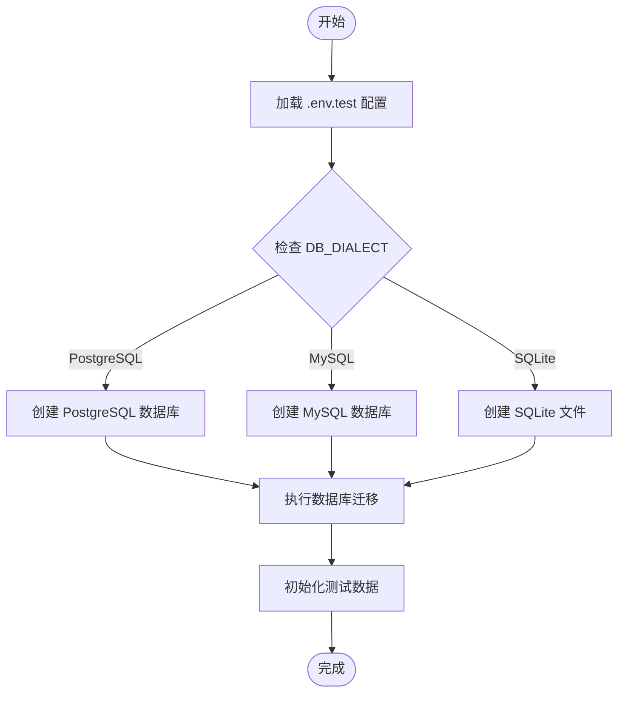
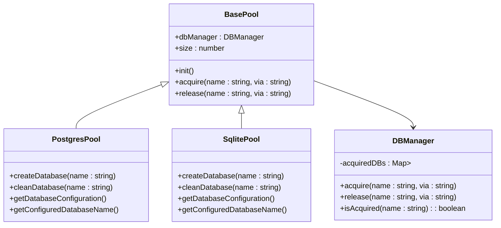
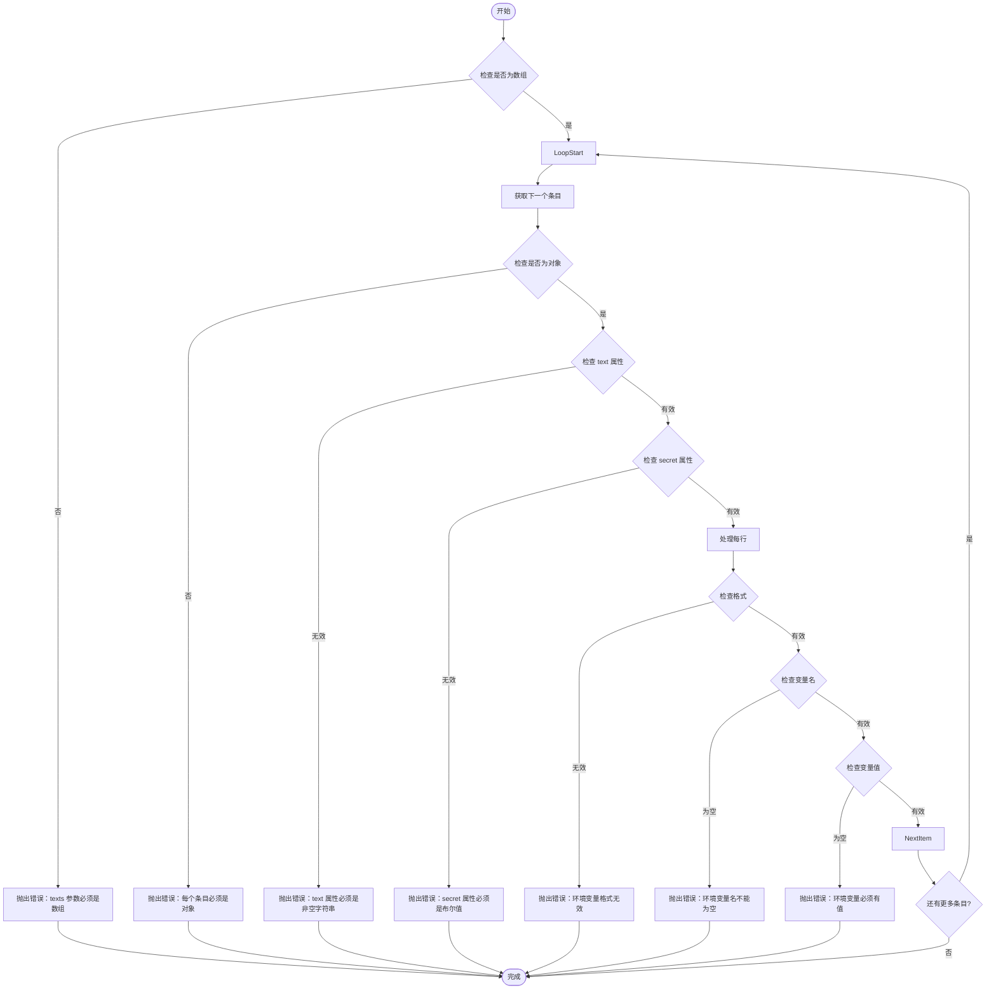

# 测试环境变量

<cite>
**本文档中引用的文件**  
- [.env.test.example](file://.env.test.example)
- [.env.e2e.example](file://.env.e2e.example)
- [.env.perf.example](file://.env.perf.example)
- [packages/core/test/setup/server.ts](file://packages/core/test/setup/server.ts)
- [packages/core/test/src/scripts/test-db-creator.ts](file://packages/core/test/src/scripts/test-db-creator.ts)
- [packages/core/test/src/scripts/test-db-distributor.ts](file://packages/core/test/src/scripts/test-db-distributor.ts)
- [packages/core/database/src/mock-database.ts](file://packages/core/database/src/mock-database.ts)
- [packages/core/test/vitest.mts](file://vitest.config.mts)
- [packages/core/test/playwright.config.ts](file://playwright.config.ts)
- [packages/plugins/@nocobase/plugin-environment-variables/src/server/plugin.ts](file://packages/plugins/@nocobase/plugin-environment-variables/src/server/plugin.ts)
- [packages/plugins/@nocobase/plugin-environment-variables/src/server/collections/environmentVariables.ts](file://packages/plugins/@nocobase/plugin-environment-variables/src/server/collections/environmentVariables.ts)
</cite>

## 目录
1. [简介](#简介)
2. [测试环境变量配置](#测试环境变量配置)
3. [测试环境隔离策略](#测试环境隔离策略)
4. [测试数据库管理机制](#测试数据库管理机制)
5. [并行测试资源隔离](#并行测试资源隔离)
6. [端到端测试配置](#端到端测试配置)
7. [性能测试配置](#性能测试配置)
8. [测试覆盖率配置](#测试覆盖率配置)
9. [环境变量验证机制](#环境变量验证机制)

## 简介
NocoBase 提供了完整的测试环境支持，通过专用的环境变量文件和配置机制，实现了单元测试、集成测试和端到端测试的全面覆盖。本文档详细说明了测试环境变量的配置方法、数据库管理机制、环境隔离策略以及并行测试执行时的资源管理方案。

**Section sources**
- [.env.test.example](file://.env.test.example)
- [.env.e2e.example](file://.env.e2e.example)

## 测试环境变量配置
NocoBase 为不同类型的测试提供了专门的环境变量配置文件，确保测试环境与开发和生产环境完全隔离。

### 单元测试和集成测试环境变量
`.env.test.example` 文件定义了单元测试和集成测试的专用环境变量：

- **APP_ENV**: 设置为 `development`，启用开发模式
- **APP_PORT**: 测试服务器端口，设置为 `13000`
- **APP_KEY**: 测试密钥，设置为 `test-key`
- **DB_DIALECT**: 数据库方言，支持 `sqlite`、`mysql`、`postgres` 等
- **DB_STORAGE**: SQLite 数据库存储路径，设置为 `storage/db/nocobase-test.sqlite`
- **INIT_ROOT_EMAIL**: 初始化超级管理员邮箱
- **INIT_ROOT_PASSWORD**: 初始化超级管理员密码
- **DEFAULT_STORAGE_TYPE**: 默认存储类型，设置为 `local`

### 环境变量加载机制
测试环境通过 `setup/server.ts` 文件中的代码自动加载 `.env.test` 配置：

```typescript
process.env.APP_ENV_PATH = process.env.APP_ENV_PATH || '.env.test';
initEnv();
```

此机制确保测试运行时优先加载测试专用的环境变量，避免与开发环境配置冲突。

**Section sources**
- [.env.test.example](file://.env.test.example)
- [packages/core/test/setup/server.ts](file://packages/core/test/setup/server.ts)

## 测试环境隔离策略
NocoBase 采用多层次的隔离策略，确保测试环境的独立性和稳定性。

### 环境变量隔离
通过不同的环境变量文件实现环境隔离：
- `.env.test.example`: 单元测试和集成测试
- `.env.e2e.example`: 端到端测试
- `.env.perf.example`: 性能测试

每种测试类型都有独立的配置文件，避免配置冲突和数据污染。

### 存储路径隔离
不同测试类型使用独立的存储路径：
- 单元测试：`storage/db/nocobase-test.sqlite`
- 端到端测试：`storage/e2e/db/nocobase.sqlite`
- 上传文件：`storage/uploads` 与 `storage/uploads-e2e`

这种隔离策略确保测试数据不会相互影响。

**Section sources**
- [.env.test.example](file://.env.test.example)
- [.env.e2e.example](file://.env.e2e.example)

## 测试数据库管理机制
NocoBase 提供了自动化的测试数据库管理机制，包括数据库的自动创建、迁移和清理。

### 数据库自动创建
`test-db-creator.ts` 脚本负责测试数据库的自动创建：

- 支持多种数据库类型：PostgreSQL、MySQL、MariaDB 和 SQLite
- 自动创建测试专用的数据库实例
- 创建后 3 分钟自动清理，避免资源浪费

### 数据库迁移机制
测试数据库的迁移通过以下流程实现：
1. 读取 `.env.test` 配置文件
2. 根据 `DB_DIALECT` 确定数据库类型
3. 连接数据库服务器
4. 创建专用的测试数据库
5. 执行数据库迁移脚本
6. 初始化测试数据



**Diagram sources**
- [.env.test.example](file://.env.test.example)
- [packages/core/test/src/scripts/test-db-creator.ts](file://packages/core/test/src/scripts/test-db-creator.ts)

**Section sources**
- [.env.test.example](file://.env.test.example)
- [packages/core/test/src/scripts/test-db-creator.ts](file://packages/core/test/src/scripts/test-db-creator.ts)

## 并行测试资源隔离
为了支持并行测试执行，NocoBase 实现了完善的资源隔离机制。

### 数据库连接池
`test-db-distributor.ts` 脚本实现了数据库连接池管理：

- 预创建多个测试数据库实例
- 动态分配数据库给测试用例
- 自动回收不再使用的数据库
- 支持配置池大小（TEST_DB_POOL_SIZE）

### 资源隔离策略
并行测试的资源隔离通过以下机制实现：
- 每个测试用例获得独立的数据库实例
- 使用 `DB_TEST_PREFIX` 环境变量标识测试数据库
- 通过 HTTP 服务协调数据库分配
- 自动清理闲置超过 1 秒的数据库



**Diagram sources**
- [packages/core/test/src/scripts/test-db-distributor.ts](file://packages/core/test/src/scripts/test-db-distributor.ts)

**Section sources**
- [packages/core/test/src/scripts/test-db-distributor.ts](file://packages/core/test/src/scripts/test-db-distributor.ts)

## 端到端测试配置
端到端测试使用专门的配置文件 `.env.e2e.example`，包含更完整的测试环境设置。

### 专用环境变量
端到端测试的特殊配置包括：
- **APP_PORT**: 设置为 `20000`，避免端口冲突
- **APP_KEY**: 设置为 `test-key-e2e`，标识端到端测试
- **__E2E__**: 设置为 `true`，启用端到端测试模式
- **SOCKET_PATH**: Unix 套接字路径，用于进程间通信
- **APPEND_PRESET_BUILT_IN_PLUGINS**: 启用 `mock-collections` 插件

### 日志配置
端到端测试的日志配置：
- **LOGGER_TRANSPORT**: 日志传输方式
- **LOGGER_LEVEL**: 日志级别
- **LOGGER_BASE_PATH**: 日志存储路径，设置为 `storage/e2e/logs`

**Section sources**
- [.env.e2e.example](file://.env.e2e.example)

## 性能测试配置
性能测试使用 `.env.perf.example` 文件进行配置，专注于性能基准测试。

### 性能测试变量
性能测试专用的环境变量：
- **TARGET_ORIGIN**: 目标服务器地址
- **API_BASE_URL**: API 基础 URL
- **WEB_BASE_URL**: Web 界面基础 URL
- **USERNAME**: 测试用户名
- **PASSWORD**: 测试密码

这些变量用于配置性能测试的目标环境和认证信息。

**Section sources**
- [.env.perf.example](file://.env.perf.example)

## 测试覆盖率配置
NocoBase 的测试框架通过 Vitest 配置测试覆盖率报告。

### 测试框架配置
`vitest.config.mts` 文件配置了测试环境：

```typescript
import { defineConfig } from '@nocobase/test/vitest.mjs';
export default defineConfig();
```

此配置集成了 NocoBase 专用的测试工具，支持：
- 单元测试
- 集成测试
- 测试覆盖率报告生成
- 快照测试

### Playwright 配置
端到端测试使用 Playwright，配置文件 `playwright.config.ts`：

```typescript
import { defineConfig } from '@nocobase/test/e2e';
export default defineConfig();
```

支持浏览器自动化测试和 UI 验证。

**Section sources**
- [vitest.config.mts](file://vitest.config.mts)
- [playwright.config.ts](file://playwright.config.ts)

## 环境变量验证机制
NocoBase 提供了环境变量验证机制，确保配置的正确性。

### 验证规则
`plugin-environment-variables` 插件实现了环境变量验证：
- 变量名必须符合命名规范
- 变量值不能为空
- 支持秘密变量标记
- 自动忽略注释行

### 验证流程
环境变量验证流程：
1. 检查输入是否为数组
2. 验证每个条目是否为对象
3. 检查文本属性是否为非空字符串
4. 验证秘密属性是否为布尔值
5. 解析每行环境变量
6. 验证键值对格式
7. 确保变量名不为空
8. 确保变量值不为空



**Diagram sources**
- [packages/plugins/@nocobase/plugin-environment-variables/src/server/plugin.ts](file://packages/plugins/@nocobase/plugin-environment-variables/src/server/plugin.ts)

**Section sources**
- [packages/plugins/@nocobase/plugin-environment-variables/src/server/plugin.ts](file://packages/plugins/@nocobase/plugin-environment-variables/src/server/plugin.ts)
- [packages/plugins/@nocobase/plugin-environment-variables/src/server/collections/environmentVariables.ts](file://packages/plugins/@nocobase/plugin-environment-variables/src/server/collections/environmentVariables.ts)