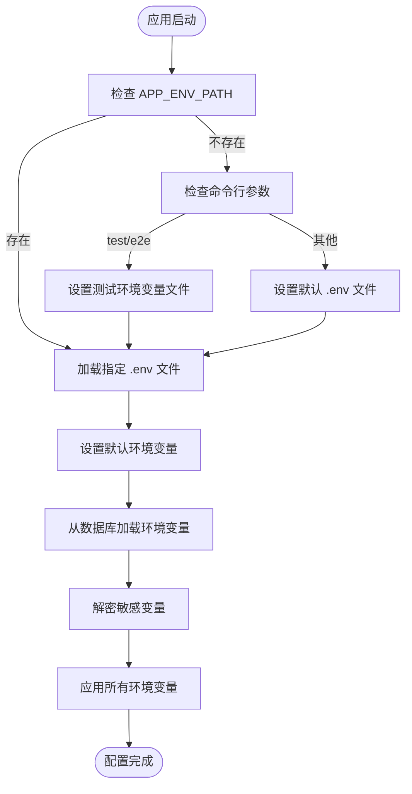
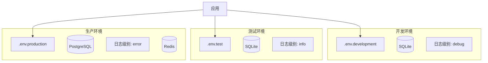
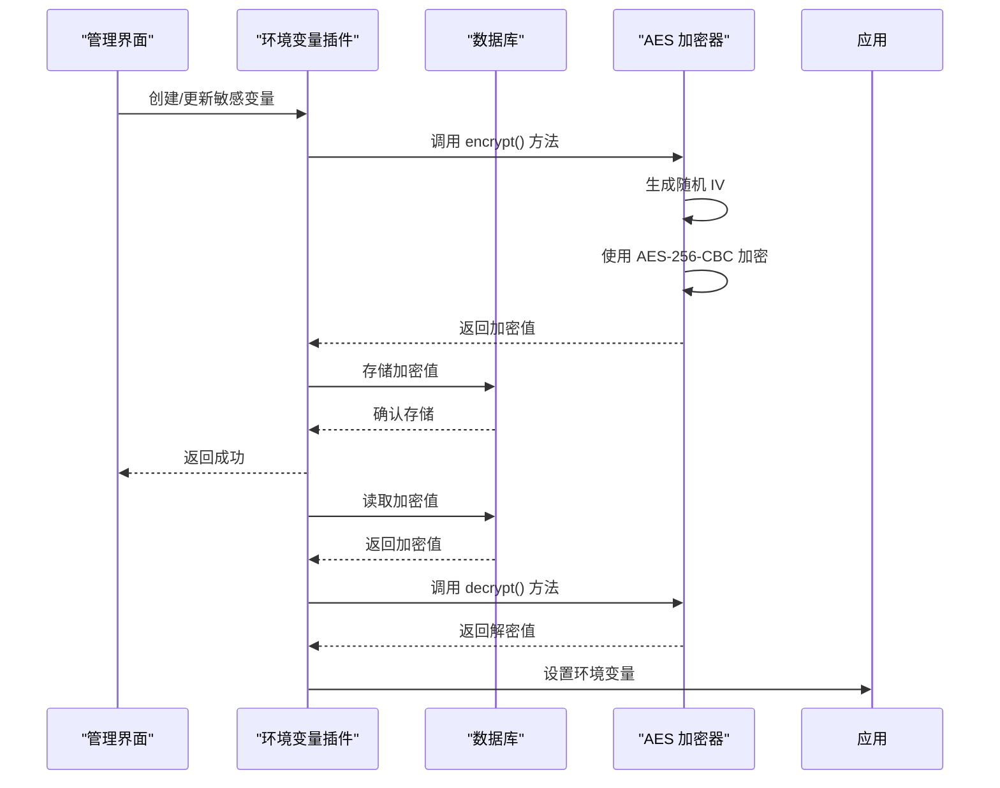
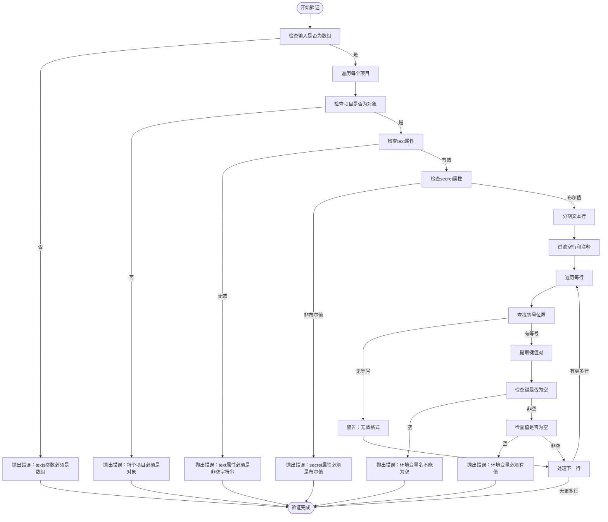

# 环境变量管理

<cite>
**本文档中引用的文件**  
- [.env.example](file://.env.example)
- [.env.test.example](file://.env.test.example)
- [packages/core/database/src/helpers.ts](file://packages/core/database/src/helpers.ts)
- [packages/core/server/src/environment.ts](file://packages/core/server/src/environment.ts)
- [packages/plugins/@nocobase/plugin-environment-variables/src/server/plugin.ts](file://packages/plugins/@nocobase/plugin-environment-variables/src/server/plugin.ts)
- [packages/core/database/src/fields/encryption-field/utils.ts](file://packages/core/database/src/fields/encryption-field/utils.ts)
- [packages/core/server/src/aes-encryptor.ts](file://packages/core/server/src/aes-encryptor.ts)
- [packages/core/cli/src/util.js](file://packages/core/cli/src/util.js)
</cite>

## 目录
1. [介绍](#介绍)
2. [核心环境变量列表](#核心环境变量列表)
3. [环境变量加载机制](#环境变量加载机制)
4. [多环境配置分离策略](#多环境配置分离策略)
5. [敏感信息保护与安全存储](#敏感信息保护与安全存储)
6. [环境变量验证机制](#环境变量验证机制)
7. [常见配置错误诊断](#常见配置错误诊断)
8. [最佳实践](#最佳实践)

## 介绍

NocoBase 提供了一套完整的环境变量管理系统，用于在不同环境中配置应用程序的行为。该系统支持通过文件、数据库和运行时环境等多种方式管理配置，确保应用程序在开发、测试和生产环境中的灵活性和安全性。环境变量涵盖了数据库连接、安全密钥、服务端口、调试模式等关键配置。

**Section sources**
- [.env.example](file://.env.example)
- [.env.test.example](file://.env.test.example)

## 核心环境变量列表

NocoBase 支持多种环境变量，按功能分类如下：

### 应用程序配置
- `APP_ENV`: 应用运行环境（development/production）
- `APP_PORT`: 应用服务端口
- `APP_KEY`: JWT 密钥，用于身份验证
- `API_BASE_PATH`: API 基础路径
- `LOGGER_TRANSPORT`: 日志输出方式（console/file/dailyRotateFile）
- `LOGGER_LEVEL`: 日志级别（error/warn/info/debug/trace）
- `CLUSTER_MODE`: 集群模式设置
- `WORKER_MODE`: 工作模式设置

### 数据库配置
- `DB_DIALECT`: 数据库类型（postgres/mysql/mariadb/sqlite）
- `DB_HOST`: 数据库主机地址
- `DB_PORT`: 数据库端口
- `DB_DATABASE`: 数据库名称
- `DB_USER`: 数据库用户名
- `DB_PASSWORD`: 数据库密码
- `DB_TABLE_PREFIX`: 表前缀
- `DB_LOGGING`: 是否启用数据库日志
- `DB_POOL_MAX`: 连接池最大连接数
- `DB_POOL_MIN`: 连接池最小连接数
- `DB_POOL_IDLE`: 连接空闲时间
- `DB_DIALECT_OPTIONS_SSL_*`: SSL 连接配置

### 缓存配置
- `CACHE_DEFAULT_STORE`: 默认缓存存储（memory/redis）
- `CACHE_MEMORY_MAX`: 内存缓存最大项目数
- `CACHE_REDIS_URL`: Redis 连接 URL

### 存储初始化配置
- `INIT_ROOT_EMAIL`: 初始化超级管理员邮箱
- `INIT_ROOT_PASSWORD`: 初始化超级管理员密码
- `INIT_ROOT_NICKNAME`: 初始化超级管理员昵称
- `INIT_ROOT_USERNAME`: 初始化超级管理员用户名

### 加密字段配置
- `ENCRYPTION_FIELD_KEY`: 加密字段密钥，必须是32字符的字符串

### 包认证配置
- `NOCOBASE_PKG_USERNAME`: 包服务用户名
- `NOCOBASE_PKG_PASSWORD`: 包服务密码

**Section sources**
- [.env.example](file://.env.example)
- [.env.test.example](file://.env.test.example)
- [packages/core/database/src/helpers.ts](file://packages/core/database/src/helpers.ts)

## 环境变量加载机制

NocoBase 的环境变量加载机制遵循特定的优先级规则，确保配置的一致性和可预测性。

### 加载优先级
1. **命令行参数**：最高优先级，直接覆盖其他配置
2. **.env.{环境} 文件**：根据 APP_ENV_PATH 指定的文件加载
3. **默认环境变量**：通过 initEnv 函数设置的默认值
4. **数据库存储的环境变量**：通过环境变量插件管理的变量

### 加载流程

**Diagram sources**
- [packages/core/cli/src/util.js](file://packages/core/cli/src/util.js#L356-L474)
- [packages/plugins/@nocobase/plugin-environment-variables/src/server/plugin.ts](file://packages/plugins/@nocobase/plugin-environment-variables/src/server/plugin.ts#L198-L216)

## 多环境配置分离策略

NocoBase 通过不同的环境变量文件实现多环境配置分离，确保各环境的独立性和安全性。

### 环境文件命名约定
- `.env`: 默认环境配置
- `.env.development`: 开发环境配置
- `.env.test`: 测试环境配置
- `.env.production`: 生产环境配置
- `.env.e2e`: 端到端测试配置
- `.env.perf`: 性能测试配置

### 环境选择机制
通过 `APP_ENV` 和 `APP_ENV_PATH` 环境变量控制环境选择：
- `APP_ENV`: 定义运行环境，影响应用行为
- `APP_ENV_PATH`: 指定要加载的环境变量文件路径

### 环境特定配置示例

**Diagram sources**
- [.env.example](file://.env.example)
- [.env.test.example](file://.env.test.example)
- [packages/core/cli/src/util.js](file://packages/core/cli/src/util.js#L390-L411)

## 敏感信息保护与安全存储

NocoBase 提供了多层次的安全机制来保护敏感信息，防止数据泄露。

### 敏感变量类型
- 数据库密码
- API 密钥
- JWT 密钥
- 加密字段密钥
- 包服务认证信息

### 加密存储机制

### 密钥管理
- **密钥生成**: 系统自动生成32字节的AES密钥
- **密钥存储**: 存储在 `storage/apps/{appName}/aes_key.dat`
- **密钥保护**: 通过文件系统权限保护密钥文件
- **密钥轮换**: 支持通过环境变量 `APP_AES_SECRET_KEY` 指定自定义密钥

### 安全访问控制
- 通过 ACL（访问控制列表）限制环境变量的访问权限
- 敏感变量在列表查询时自动隐藏值
- 只有授权用户才能查看和修改环境变量

**Diagram sources**
- [packages/plugins/@nocobase/plugin-environment-variables/src/server/plugin.ts](file://packages/plugins/@nocobase/plugin-environment-variables/src/server/plugin.ts#L153-L157)
- [packages/core/server/src/aes-encryptor.ts](file://packages/core/server/src/aes-encryptor.ts#L15-L55)
- [packages/plugins/@nocobase/plugin-environment-variables/src/server/plugin.ts](file://packages/plugins/@nocobase/plugin-environment-variables/src/server/plugin.ts#L165-L168)

**Section sources**
- [packages/plugins/@nocobase/plugin-environment-variables/src/server/plugin.ts](file://packages/plugins/@nocobase/plugin-environment-variables/src/server/plugin.ts)
- [packages/core/server/src/aes-encryptor.ts](file://packages/core/server/src/aes-encryptor.ts)
- [packages/core/database/src/fields/encryption-field/utils.ts](file://packages/core/database/src/fields/encryption-field/utils.ts)

## 环境变量验证机制

NocoBase 实现了严格的环境变量验证机制，确保配置的正确性和安全性。

### 语法验证
- 检查环境变量格式是否符合 `KEY=VALUE` 规范
- 验证变量名不能为空
- 验证变量值不能为空
- 忽略注释行（以 # 开头）和空行

### 类型验证
- 字符串类型验证
- 数字类型转换和验证
- 布尔类型转换（true/false）

### 安全验证
- `ENCRYPTION_FIELD_KEY` 必须是32字符的字符串
- 数据库连接参数完整性验证
- 时区配置一致性验证

### 验证流程

**Diagram sources**
- [packages/plugins/@nocobase/plugin-environment-variables/src/server/plugin.ts](file://packages/plugins/@nocobase/plugin-environment-variables/src/server/plugin.ts#L54-L95)

## 常见配置错误诊断

### 数据库连接问题
**症状**: 应用无法启动，数据库连接失败
**可能原因**:
- 数据库主机地址错误
- 端口配置不正确
- 数据库用户名或密码错误
- 数据库服务未运行

**解决方案**:
1. 检查 `.env` 文件中的 `DB_HOST`、`DB_PORT` 配置
2. 验证数据库服务是否正常运行
3. 使用数据库客户端测试连接
4. 检查防火墙设置

### 环境变量未生效
**症状**: 配置更改后应用行为未改变
**可能原因**:
- 环境变量文件未正确加载
- 变量名拼写错误
- 缓存未清除
- 应用未重启

**解决方案**:
1. 确认 `APP_ENV_PATH` 指向正确的环境文件
2. 检查变量名是否正确
3. 清除应用缓存
4. 重启应用服务

### 敏感信息泄露
**症状**: 安全审计发现敏感信息明文存储
**可能原因**:
- 未使用 `secret` 类型存储敏感变量
- 环境变量文件被提交到版本控制系统
- 日志中记录了敏感信息

**解决方案**:
1. 将敏感变量存储为 `secret` 类型
2. 将 `.env` 文件添加到 `.gitignore`
3. 配置日志过滤器，避免记录敏感信息
4. 定期轮换密钥和密码

### 时区配置冲突
**症状**: 时间显示不正确，数据库时区与系统时区不一致
**可能原因**:
- `DB_TIMEZONE` 与 `TZ` 环境变量不匹配
- 时区格式不正确

**解决方案**:
1. 确保 `DB_TIMEZONE` 和 `TZ` 设置相同的时区
2. 使用标准时区格式（如 +08:00）
3. 在启动时检查时区一致性

**Section sources**
- [packages/core/cli/src/util.js](file://packages/core/cli/src/util.js#L440-L458)
- [packages/plugins/@nocobase/plugin-environment-variables/src/server/plugin.ts](file://packages/plugins/@nocobase/plugin-environment-variables/src/server/plugin.ts)
- [.env.example](file://.env.example)

## 最佳实践

### 环境变量管理
- **使用环境文件**: 为不同环境创建独立的 `.env` 文件
- **避免硬编码**: 所有配置都应通过环境变量管理
- **合理命名**: 使用清晰、一致的命名约定
- **文档化**: 记录所有环境变量的用途和默认值

### 安全性
- **加密敏感信息**: 使用 `secret` 类型存储密码、密钥等敏感信息
- **权限控制**: 限制环境变量的访问权限
- **定期审计**: 定期检查环境变量配置的安全性
- **密钥轮换**: 定期更换加密密钥和密码

### 开发流程
- **.env.example**: 提供示例文件，包含所有可能的变量
- **.env.local**: 本地开发专用，不应提交到版本控制
- **环境隔离**: 确保开发、测试、生产环境完全隔离
- **自动化测试**: 在测试环境中验证配置变更

### 性能优化
- **连接池配置**: 根据应用负载调整数据库连接池大小
- **缓存策略**: 合理配置缓存，提高应用性能
- **日志级别**: 生产环境中使用适当的日志级别，避免过度日志

**Section sources**
- [.env.example](file://.env.example)
- [packages/core/cli/src/util.js](file://packages/core/cli/src/util.js)
- [packages/plugins/@nocobase/plugin-environment-variables/src/server/plugin.ts](file://packages/plugins/@nocobase/plugin-environment-variables/src/server/plugin.ts)