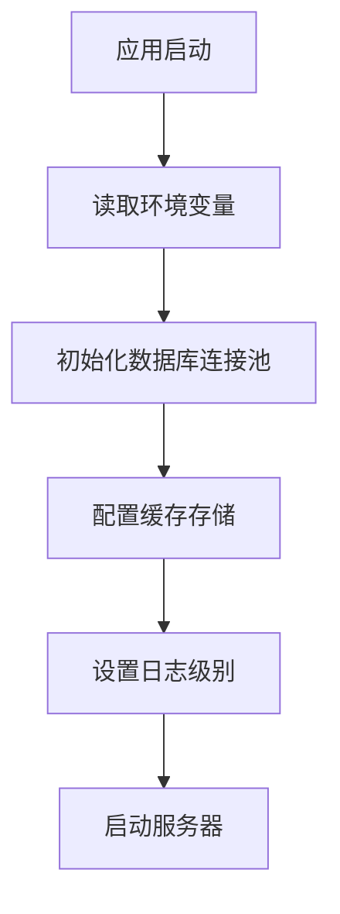
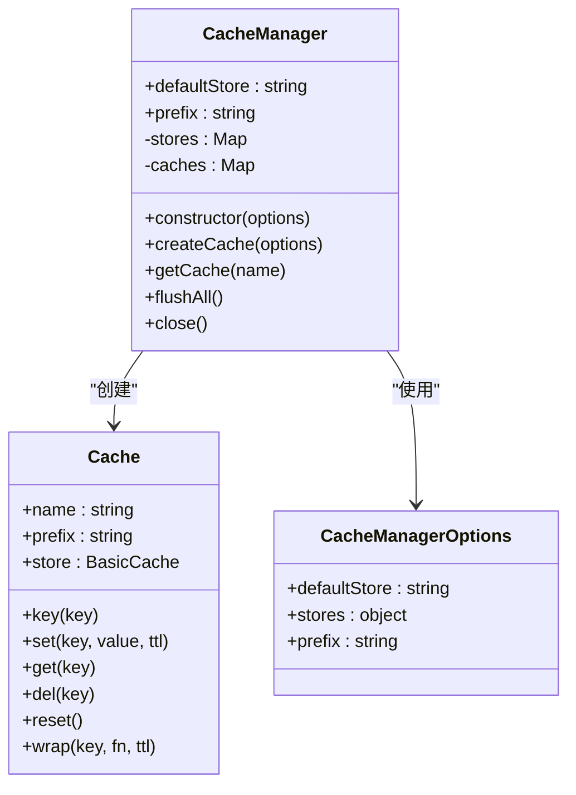
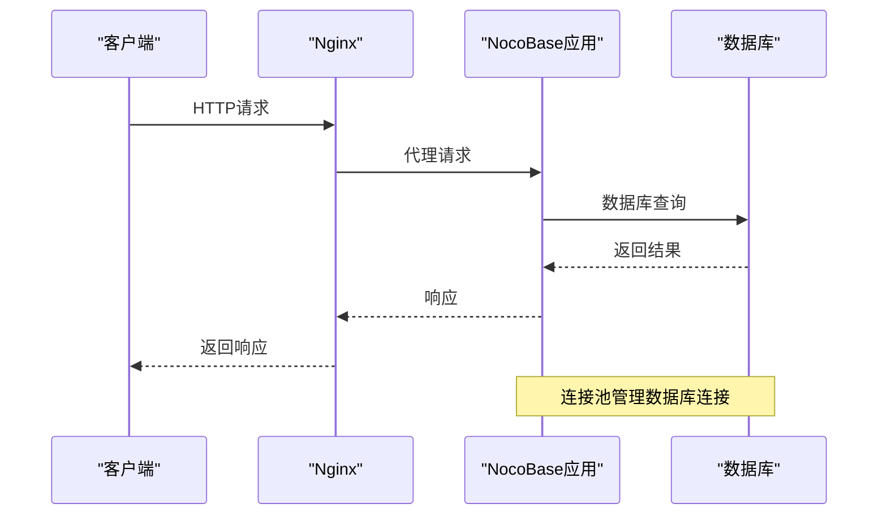

# 性能调优

<cite>
**本文档中引用的文件**  
- [.env.example](file://.env.example)
- [.env.perf.example](file://.env.perf.example)
- [docker/nocobase/nocobase.conf](file://docker/nocobase/nocobase.conf)
- [docker-compose.yml](file://docker-compose.yml)
- [packages/core/database/src/helpers.ts](file://packages/core/database/src/helpers.ts)
- [packages/core/app/src/config/cache.ts](file://packages/core/app/src/config/cache.ts)
- [packages/core/app/src/config/logger.ts](file://packages/core/app/src/config/logger.ts)
- [packages/core/logger/src/config.ts](file://packages/core/logger/src/config.ts)
- [packages/core/logger/src/transports.ts](file://packages/core/logger/src/transports.ts)
- [packages/core/cache/src/cache-manager.ts](file://packages/core/cache/src/cache-manager.ts)
- [packages/core/cache/src/cache.ts](file://packages/core/cache/src/cache.ts)
- [packages/core/cache/src/counter/memory-counter.ts](file://packages/core/cache/src/counter/memory-counter.ts)
- [packages/core/cache/src/counter/redis-counter.ts](file://packages/core/cache/src/counter/redis-counter.ts)
- [packages/core/test/src/scripts/test-db-distributor.ts](file://packages/core/test/src/scripts/test-db-distributor.ts)
- [benchmark/README.md](file://benchmark/README.md)
- [benchmark/nocobase-server/index.js](file://benchmark/nocobase-server/index.js)
- [benchmark/koa-database/index.js](file://benchmark/koa-database/index.js)
</cite>

## 目录
1. [引言](#引言)
2. [核心配置参数](#核心配置参数)
3. [资源优化配置](#资源优化配置)
4. [负载均衡与缓存策略](#负载均衡与缓存策略)
5. [数据库查询优化](#数据库查询优化)
6. [性能监控与基准测试](#性能监控与基准测试)
7. [部署最佳实践](#部署最佳实践)
8. [常见性能瓶颈诊断](#常见性能瓶颈诊断)
9. [结论](#结论)

## 引言

NocoBase 是一个低代码开发平台，其性能调优涉及多个关键配置参数和系统组件。本文档深入探讨影响系统性能的关键配置，包括线程池大小、连接池配置、内存限制、请求超时设置和并发处理能力。同时，提供CPU、内存、I/O等资源的优化配置方法，以及负载均衡、缓存策略和数据库查询优化的指导。通过性能监控工具配置和基准测试方法，帮助用户实现不同规模部署的性能调优最佳实践，并诊断解决常见性能瓶颈。

**本文档中引用的文件**  
- [.env.example](file://.env.example)
- [.env.perf.example](file://.env.perf.example)

## 核心配置参数

NocoBase 的性能调优始于对核心配置参数的深入理解。这些参数直接影响系统的并发处理能力、资源利用率和响应时间。

### 线程池与连接池配置

NocoBase 使用 Sequelize 作为其 ORM 框架，数据库连接池的配置至关重要。通过环境变量可以精细控制连接池的行为：

- **DB_POOL_MAX**: 连接池中最大连接数，默认为5。在高并发场景下，应根据数据库服务器的处理能力适当增加此值。
- **DB_POOL_MIN**: 连接池中最小连接数，默认为0。保持一定数量的空闲连接可以减少连接建立的开销。
- **DB_POOL_IDLE**: 连接在池中空闲的最长时间（毫秒），默认为10000。超过此时间的空闲连接将被释放。
- **DB_POOL_ACQUIRE**: 从池中获取连接的超时时间（毫秒），默认为60000。如果在此时间内无法获取连接，将抛出错误。
- **DB_POOL_EVICT**: 从池中逐出连接的间隔时间（毫秒），默认为1000。
- **DB_POOL_MAX_USES**: 每个连接的最大使用次数，设置为0表示无限制。

这些配置在 `packages/core/database/src/helpers.ts` 中通过 `getPoolOptions` 函数解析环境变量实现。

### 内存限制与请求超时

内存和超时设置是防止系统资源耗尽的关键：

- **CACHE_MEMORY_MAX**: 内存缓存的最大条目数，默认为2000。根据可用内存和缓存命中率调整此值。
- **proxy_connect_timeout**, **proxy_send_timeout**, **proxy_read_timeout**: Nginx 代理的连接、发送和读取超时时间，在 `docker/nocobase/nocobase.conf` 中设置为600秒，适用于长时间运行的请求。

**本文档中引用的文件**  
- [.env.example](file://.env.example#L59-L66)
- [packages/core/database/src/helpers.ts](file://packages/core/database/src/helpers.ts#L77-L97)
- [docker/nocobase/nocobase.conf](file://docker/nocobase/nocobase.conf#L77-L80)

## 资源优化配置

### CPU 优化

NocoBase 支持集群模式运行，通过 `CLUSTER_MODE` 环境变量配置。在生产环境中，建议启用集群模式以充分利用多核 CPU 的并行处理能力。同时，合理配置 `WORKER_MODE` 可以将后台任务与用户请求分离，提高 CPU 利用效率。

### 内存优化

内存优化主要涉及缓存和日志配置：

- **CACHE_DEFAULT_STORE**: 默认缓存存储，可设置为 `memory` 或 `redis`。对于内存充足的服务器，使用内存缓存可以获得最佳性能。
- **LOGGER_LEVEL**: 日志级别，开发环境建议使用 `debug`，生产环境建议使用 `info` 或 `error` 以减少 I/O 开销。



**本文档中引用的文件**  
- [.env.example](file://.env.example#L75-L78)
- [packages/core/app/src/config/cache.ts](file://packages/core/app/src/config/cache.ts)
- [packages/core/app/src/config/logger.ts](file://packages/core/app/src/config/logger.ts)

## 负载均衡与缓存策略

### 负载均衡配置

NocoBase 通过 Nginx 实现负载均衡和反向代理。`docker/nocobase/nocobase.conf` 文件定义了详细的代理规则：

- 静态资源（JS、CSS）缓存365天，提高前端性能。
- API 请求代理到后端服务，设置600秒超时以支持长时间操作。
- WebSocket 连接通过升级协议直接转发。

### 缓存策略优化

NocoBase 提供了灵活的缓存管理机制：

- **内存缓存**: 适用于小规模、高频访问的数据，配置简单，性能最佳。
- **Redis 缓存**: 适用于大规模、分布式部署，支持数据持久化和共享。

缓存管理器在 `packages/core/cache/src/cache-manager.ts` 中实现，支持多种存储后端和全局配置。



**本文档中引用的文件**  
- [docker/nocobase/nocobase.conf](file://docker/nocobase/nocobase.conf)
- [packages/core/cache/src/cache-manager.ts](file://packages/core/cache/src/cache-manager.ts)
- [packages/core/cache/src/cache.ts](file://packages/core/cache/src/cache.ts)

## 数据库查询优化

### 连接池优化

数据库连接池是性能调优的核心。根据 `packages/core/test/src/scripts/test-db-distributor.ts` 中的测试代码，NocoBase 支持为不同数据库（PostgreSQL、SQLite）创建连接池。通过合理配置连接池参数，可以避免连接泄漏和资源争用。

### 查询性能优化

- **索引优化**: 为频繁查询的字段创建索引，特别是外键和唯一约束字段。
- **批量操作**: 使用批量插入、更新和删除操作减少数据库往返次数。
- **查询缓存**: 对于不经常变化的查询结果，使用缓存避免重复查询。



**本文档中引用的文件**  
- [packages/core/test/src/scripts/test-db-distributor.ts](file://packages/core/test/src/scripts/test-db-distributor.ts)
- [.env.example](file://.env.example#L59-L66)

## 性能监控与基准测试

### 性能监控工具配置

NocoBase 提供了详细的日志配置选项：

- **LOGGER_TRANSPORT**: 日志输出方式，支持 `console`、`file`、`dailyRotateFile`。
- **LOGGER_MAX_FILES**: 日志文件最大保留数量。
- **LOGGER_MAX_SIZE**: 单个日志文件最大大小。

这些配置在 `packages/core/logger/src/transports.ts` 中实现，支持灵活的日志轮转和存储策略。

### 基准测试方法

NocoBase 提供了基准测试套件，位于 `benchmark/` 目录：

- **koa-database**: 测试数据库访问性能。
- **nocobase-server**: 测试完整NocoBase服务器性能。
- 使用 `wrk` 工具进行压力测试，例如：`wrk -t20 -c20 -d20s http://localhost:13030/api/users`。


**本文档中引用的文件**  
- [benchmark/README.md](file://benchmark/README.md)
- [benchmark/nocobase-server/index.js](file://benchmark/nocobase-server/index.js)
- [packages/core/logger/src/transports.ts](file://packages/core/logger/src/transports.ts)

## 部署最佳实践

### 不同规模部署的性能调优

- **小型部署**: 使用内存缓存，连接池大小设置为5-10，日志级别为 `info`。
- **中型部署**: 使用Redis缓存，连接池大小设置为20-50，启用集群模式。
- **大型部署**: 分布式架构，分离主服务器和工作服务器，使用 `WORKER_MODE` 配置专门处理后台任务。

### 配置示例

```env
# 生产环境配置
APP_ENV=production
CLUSTER_MODE=2
WORKER_MODE=!
DB_POOL_MAX=30
DB_POOL_MIN=5
CACHE_DEFAULT_STORE=redis
CACHE_REDIS_URL=redis://localhost:6379
LOGGER_LEVEL=info
LOGGER_TRANSPORT=file,dailyRotateFile
```

**本文档中引用的文件**  
- [.env.example](file://.env.example)
- [docker-compose.yml](file://docker-compose.yml)

## 常见性能瓶颈诊断

### 诊断方法

1. **监控连接池状态**: 检查是否有连接泄漏或连接不足。
2. **分析慢查询日志**: 识别执行时间过长的数据库查询。
3. **检查缓存命中率**: 低命中率可能表明缓存策略需要调整。
4. **监控系统资源**: CPU、内存、I/O 使用率是否达到瓶颈。

### 解决方案

- **连接池耗尽**: 增加 `DB_POOL_MAX` 或优化查询减少连接持有时间。
- **高CPU使用率**: 启用集群模式，分离计算密集型任务。
- **内存不足**: 减少 `CACHE_MEMORY_MAX` 或使用Redis外部缓存。
- **慢响应**: 优化数据库索引，使用查询缓存。

**本文档中引用的文件**  
- [.env.example](file://.env.example)
- [packages/core/database/src/helpers.ts](file://packages/core/database/src/helpers.ts)

## 结论

NocoBase 的性能调优是一个系统工程，涉及配置参数、资源管理、缓存策略和数据库优化等多个方面。通过合理配置连接池、缓存和日志，结合负载均衡和集群模式，可以显著提升系统性能。定期进行基准测试和性能监控，及时诊断和解决性能瓶颈，是确保系统稳定高效运行的关键。本文档提供的最佳实践和配置建议，可帮助用户根据实际部署规模实现最优性能。