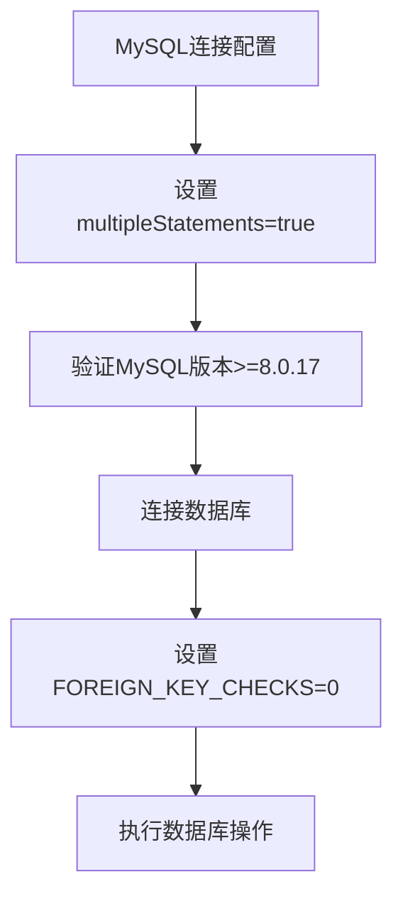
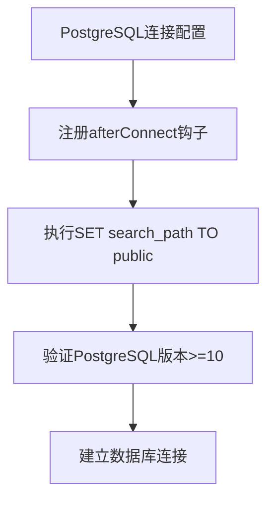
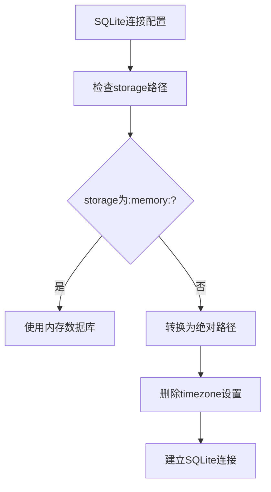
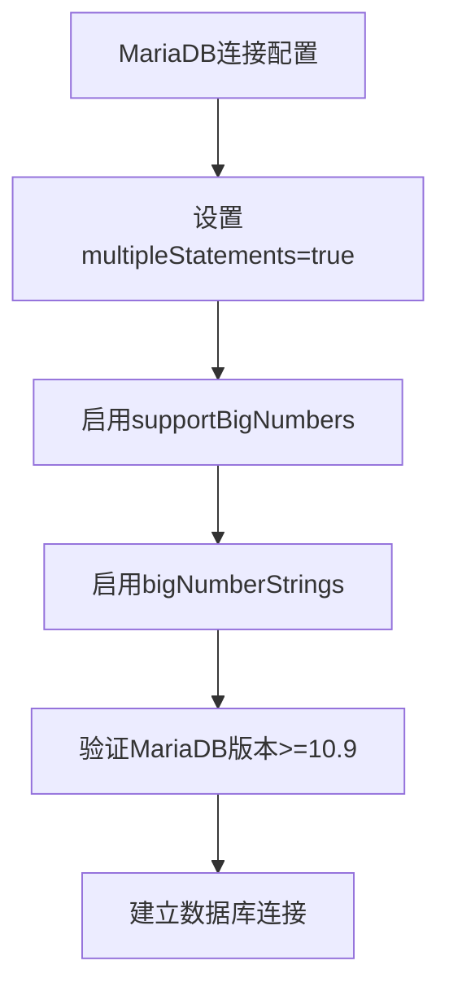
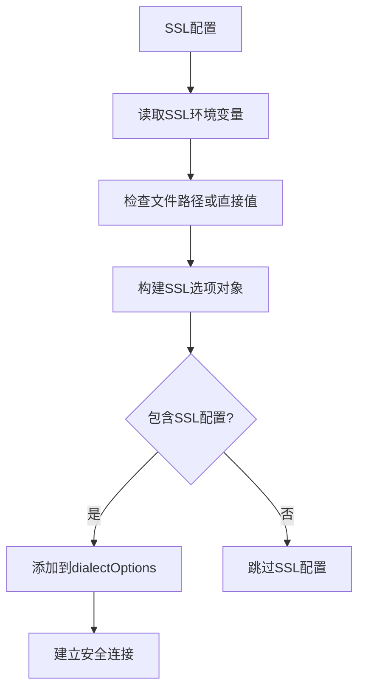
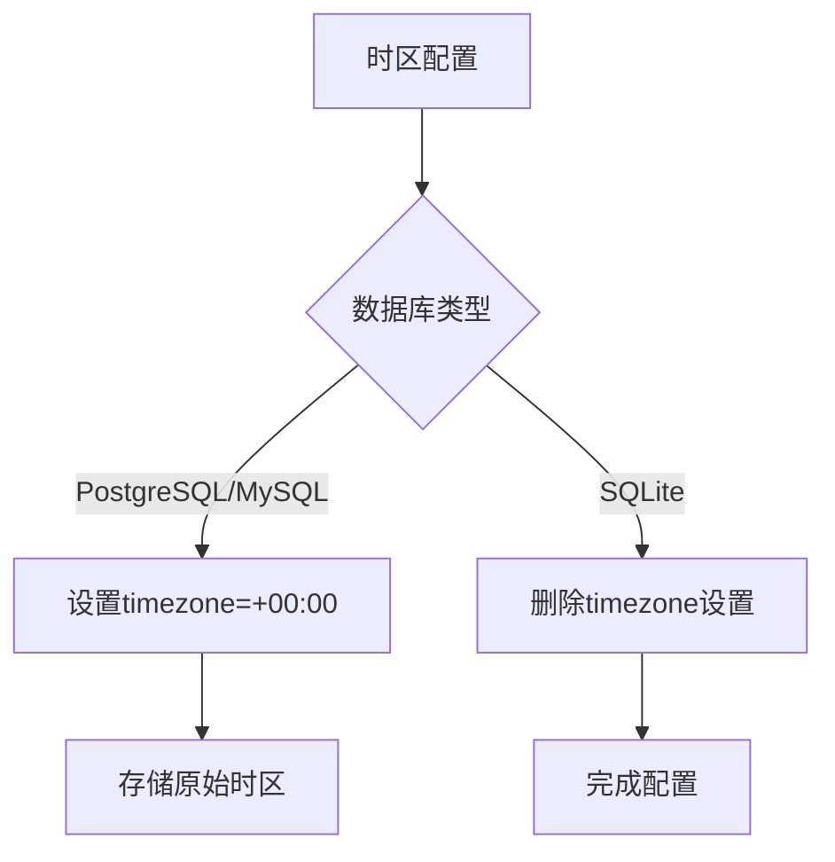
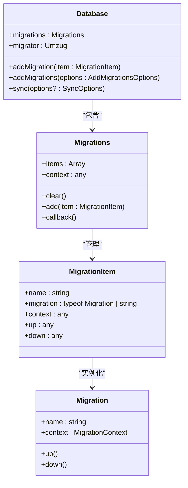
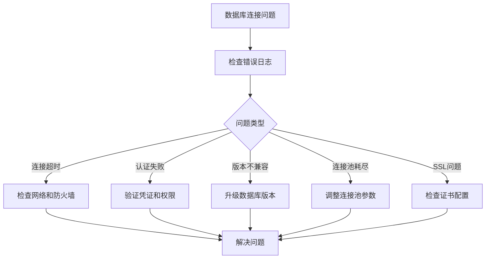

# 数据库配置

<cite>
**本文档中引用的文件**   
- [helpers.ts](file://packages/core/database/src/helpers.ts)
- [database.ts](file://packages/core/database/src/database.ts)
- [mysql-dialect.ts](file://packages/core/database/src/dialects/mysql-dialect.ts)
- [postgres-dialect.ts](file://packages/core/database/src/dialects/postgres-dialect.ts)
- [sqlite-dialect.ts](file://packages/core/database/src/dialects/sqlite-dialect.ts)
- [mariadb-dialect.ts](file://packages/core/database/src/dialects/mariadb-dialect.ts)
- [.env.example](file://.env.example)
- [test-db-distributor.ts](file://packages/core/test/src/scripts/test-db-distributor.ts)
- [test-db-creator.ts](file://packages/core/test/src/scripts/test-db-creator.ts)
</cite>

## 目录
1. [数据库连接配置参数](#数据库连接配置参数)
2. [不同数据库的特定配置要求](#不同数据库的特定配置要求)
3. [数据库连接字符串格式规范](#数据库连接字符串格式规范)
4. [SSL配置、字符集和时区设置](#ssl配置字符集和时区设置)
5. [数据库迁移配置与同步策略](#数据库迁移配置与同步策略)
6. [性能优化建议](#性能优化建议)
7. [生产环境最佳实践](#生产环境最佳实践)
8. [常见连接问题解决方案](#常见连接问题解决方案)

## 数据库连接配置参数

NocoBase支持通过环境变量配置数据库连接参数，这些参数涵盖了主机、端口、用户名、密码、数据库名称、连接池大小和超时设置等关键配置项。系统通过`parseDatabaseOptionsFromEnv`函数从环境变量中解析数据库配置选项。

主要配置参数包括：
- **DB_DIALECT**: 数据库类型，支持postgres、mysql、mariadb、sqlite
- **DB_HOST**: 数据库主机地址，默认为localhost
- **DB_PORT**: 数据库端口，PostgreSQL默认为5432，MySQL/MariaDB默认为3306
- **DB_DATABASE**: 数据库名称
- **DB_USER**: 数据库用户名
- **DB_PASSWORD**: 数据库密码
- **DB_STORAGE**: SQLite数据库文件路径，内存数据库使用`:memory:`
- **DB_TABLE_PREFIX**: 数据库表前缀
- **DB_SCHEMA**: 数据库模式（schema）
- **DB_UNDERSCORED**: 是否使用下划线命名法
- **DB_TIMEZONE**: 时区设置

**Section sources**
- [helpers.ts](file://packages/core/database/src/helpers.ts#L100-L125)
- [.env.example](file://.env.example#L48-L58)

## 不同数据库的特定配置要求

NocoBase支持多种数据库系统，每种数据库都有其特定的配置要求和最佳实践。

### MySQL配置要求
MySQL数据库需要配置`multipleStatements`选项为true，以支持多语句执行。系统要求MySQL版本不低于8.0.17。在连接时，NocoBase会自动设置`SET FOREIGN_KEY_CHECKS = 0`来处理外键约束。



**Diagram sources**
- [mysql-dialect.ts](file://packages/core/database/src/dialects/mysql-dialect.ts#L14-L38)
- [database.ts](file://packages/core/database/src/database.ts#L780-L797)

### PostgreSQL配置要求
PostgreSQL数据库在连接后会自动执行`SET search_path TO public`命令，确保搜索路径正确。系统要求PostgreSQL版本不低于10。对于PostgreSQL，时区设置不会被删除，而是默认设置为'+00:00'。



**Diagram sources**
- [postgres-dialect.ts](file://packages/core/database/src/dialects/postgres-dialect.ts#L13-L43)
- [database.ts](file://packages/core/database/src/database.ts#L222-L226)

### SQLite配置要求
SQLite数据库使用文件存储，支持内存数据库（`:memory:`）。当使用文件存储时，系统会自动将相对路径转换为绝对路径。SQLite不支持时区设置，因此在配置中会删除timezone选项。



**Diagram sources**
- [sqlite-dialect.ts](file://packages/core/database/src/dialects/sqlite-dialect.ts#L12-L23)
- [database.ts](file://packages/core/database/src/database.ts#L213-L224)

### MariaDB配置要求
MariaDB数据库配置与MySQL类似，但额外支持大数字处理。系统配置了`supportBigNumbers`和`bigNumberStrings`选项为true，以正确处理大数值。MariaDB要求版本不低于10.9。



**Diagram sources**
- [mariadb-dialect.ts](file://packages/core/database/src/dialects/mariadb-dialect.ts#L13-L37)

## 数据库连接字符串格式规范

NocoBase通过环境变量而非传统的连接字符串来配置数据库连接。这种配置方式更加安全和灵活，特别是在容器化部署环境中。

### 环境变量配置格式
数据库连接配置主要通过以下环境变量进行：

```env
# 数据库类型
DB_DIALECT=postgres|mysql|mariadb|sqlite

# 连接信息
DB_HOST=localhost
DB_PORT=5432
DB_DATABASE=nocobase
DB_USER=nocobase
DB_PASSWORD=nocobase

# 存储配置（SQLite专用）
DB_STORAGE=:memory: 或 /path/to/database.db
```

### 连接池配置
连接池配置通过专门的环境变量进行设置，允许精细控制数据库连接行为：

```env
# 连接池最大连接数
DB_POOL_MAX=5

# 连接池最小连接数  
DB_POOL_MIN=0

# 连接在池中保持空闲而不被释放的时间（毫秒）
DB_POOL_IDLE=10000

# 获取连接的超时时间（毫秒）
DB_POOL_ACQUIRE=60000

# 从池中淘汰空闲连接的时间间隔（毫秒）
DB_POOL_EVICT=1000

# 连接被重用的次数限制，0表示无限
DB_POOL_MAX_USES=0
```

**Section sources**
- [helpers.ts](file://packages/core/database/src/helpers.ts#L77-L98)
- [.env.example](file://.env.example#L60-L67)

## SSL配置、字符集和时区设置

### SSL配置
NocoBase支持通过环境变量配置SSL连接，确保数据库通信的安全性。SSL配置选项包括：

- **DB_DIALECT_OPTIONS_SSL_MODE**: SSL模式
- **DB_DIALECT_OPTIONS_SSL_CA**: CA证书文件路径
- **DB_DIALECT_OPTIONS_SSL_KEY**: 客户端密钥文件路径
- **DB_DIALECT_OPTIONS_SSL_CERT**: 客户端证书文件路径
- **DB_DIALECT_OPTIONS_SSL_REJECT_UNAUTHORIZED**: 是否拒绝未授权连接

系统通过`extractSSLOptionsFromEnv`函数从环境变量中提取SSL配置，并将其整合到数据库连接选项中。



**Diagram sources**
- [helpers.ts](file://packages/core/database/src/helpers.ts#L57-L75)

### 字符集设置
字符集设置主要通过数据库自身的配置来管理。对于MySQL和MariaDB，建议使用utf8mb4字符集以支持完整的Unicode字符，包括表情符号。在NocoBase中，字符集通常在数据库创建时设置，而不是在应用连接配置中指定。

### 时区配置
时区通过`DB_TIMEZONE`环境变量进行设置。对于PostgreSQL和MySQL，时区默认设置为'+00:00'（UTC）。SQLite数据库不支持时区设置，因此在SQLite配置中会删除timezone选项。



**Section sources**
- [helpers.ts](file://packages/core/database/src/helpers.ts#L110)
- [database.ts](file://packages/core/database/src/database.ts#L222-L226)

## 数据库迁移配置与同步策略

### 迁移系统架构
NocoBase使用Umzug作为迁移工具，与Sequelize集成实现数据库模式管理。迁移系统通过`Migrations`类管理迁移脚本，支持异步导入和执行。



**Diagram sources**
- [migration.ts](file://packages/core/database/src/migration.ts#L59-L103)
- [database.ts](file://packages/core/database/src/database.ts#L139-L140)

### 同步策略
数据库同步通过`sync`方法实现，支持多种同步选项。系统在同步前会根据数据库类型执行特定的预处理操作：

```mermaid
flowchart TD
A[数据库同步] --> B{数据库类型}
B --> |MySQL/MariaDB| C[SET FOREIGN_KEY_CHECKS = 0]
B --> |PostgreSQL| D[CREATE SCHEMA IF NOT EXISTS]
C --> E[执行Sequelize.sync()]
D --> E
E --> F{MySQL/MariaDB?}
F --> |是| G[SET FOREIGN_KEY_CHECKS = 1]
F --> |否| H[完成同步]
G --> I[完成同步]
```

**Section sources**
- [database.ts](file://packages/core/database/src/database.ts#L780-L797)

## 性能优化建议

### 连接池优化
合理的连接池配置对应用性能至关重要。建议根据应用负载和数据库服务器能力调整连接池参数：

- **DB_POOL_MAX**: 根据数据库服务器的并发连接限制设置，通常为CPU核心数的2-4倍
- **DB_POOL_MIN**: 在高负载应用中可设置为非零值，避免频繁创建连接
- **DB_POOL_IDLE**: 根据应用的连接使用模式调整，较短的空闲时间可更快释放资源
- **DB_POOL_ACQUIRE**: 设置合理的获取超时，避免请求无限等待
- **DB_POOL_EVICT**: 定期清理空闲连接，防止连接老化

### 查询性能优化
- 启用查询日志（DB_LOGGING=on）监控慢查询
- 使用适当的索引策略
- 避免N+1查询问题
- 批量操作时使用事务

### 缓存策略
- 启用数据库查询结果缓存
- 使用Redis等外部缓存系统存储频繁访问的数据
- 实现适当的缓存失效策略

**Section sources**
- [helpers.ts](file://packages/core/database/src/helpers.ts#L77-L98)
- [database.ts](file://packages/core/database/src/database.ts#L240-L242)

## 生产环境最佳实践

### 安全配置
- 使用环境变量而非硬编码存储数据库凭证
- 为应用使用专用数据库用户，遵循最小权限原则
- 启用SSL/TLS加密数据库连接
- 定期轮换数据库密码
- 使用强密码策略

### 高可用性配置
- 配置适当的连接池参数以处理峰值负载
- 实现连接重试机制
- 监控数据库连接状态
- 设置合理的超时值

### 备份与恢复
- 定期备份数据库
- 测试备份恢复流程
- 使用事务确保数据一致性
- 考虑使用数据库的高可用和复制功能

### 监控与告警
- 监控数据库连接数、查询性能和资源使用情况
- 设置连接失败告警
- 记录数据库操作日志
- 定期审查数据库性能指标

**Section sources**
- [.env.example](file://.env.example#L68-L73)

## 常见连接问题解决方案

### 连接超时问题
**症状**: 连接数据库时超时或长时间无响应
**解决方案**:
1. 检查数据库服务器是否运行
2. 验证主机地址和端口配置正确
3. 检查网络连接和防火墙设置
4. 调整DB_POOL_ACQUIRE值增加获取连接超时时间

### 认证失败问题
**症状**: 用户名或密码错误，无法认证
**解决方案**:
1. 验证DB_USER和DB_PASSWORD环境变量值正确
2. 检查数据库用户权限
3. 确认数据库服务器允许远程连接（如适用）
4. 检查数据库用户是否被锁定

### 版本兼容性问题
**症状**: 数据库版本不兼容错误
**解决方案**:
1. 检查数据库版本是否满足最低要求：
   - MySQL: >=8.0.17
   - PostgreSQL: >=10
   - MariaDB: >=10.9
   - SQLite: 3.x
2. 升级数据库到兼容版本
3. 检查数据库驱动版本兼容性

### 连接池耗尽问题
**症状**: 应用无法获取数据库连接
**解决方案**:
1. 增加DB_POOL_MAX值
2. 检查是否有连接泄漏，确保所有数据库操作后正确释放连接
3. 调整DB_POOL_IDLE值，及时释放空闲连接
4. 优化应用逻辑，减少同时进行的数据库操作

### SSL连接问题
**症状**: SSL握手失败或证书验证错误
**解决方案**:
1. 验证SSL证书文件路径正确
2. 检查证书是否过期
3. 确认CA证书链完整
4. 临时设置DB_DIALECT_OPTIONS_SSL_REJECT_UNAUTHORIZED=false进行测试（仅用于诊断）



**Diagram sources**
- [database.ts](file://packages/core/database/src/database.ts#L840-L873)
- [test-db-creator.ts](file://packages/core/test/src/scripts/test-db-creator.ts#L74-L135)
- [test-db-distributor.ts](file://packages/core/test/src/scripts/test-db-distributor.ts#L119-L131)