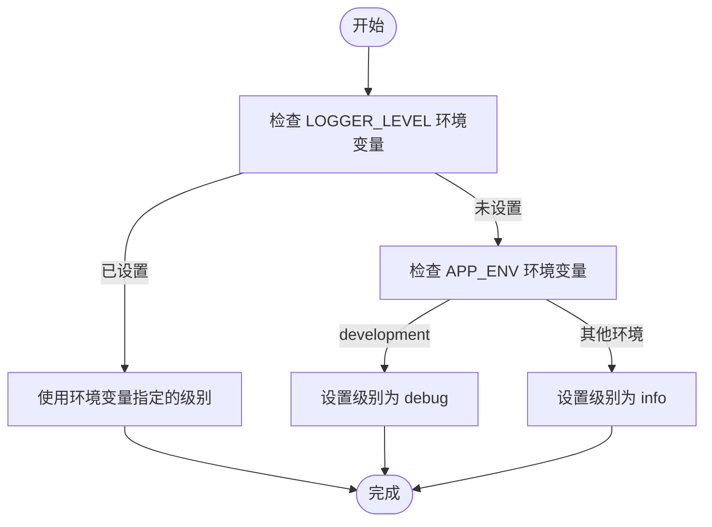
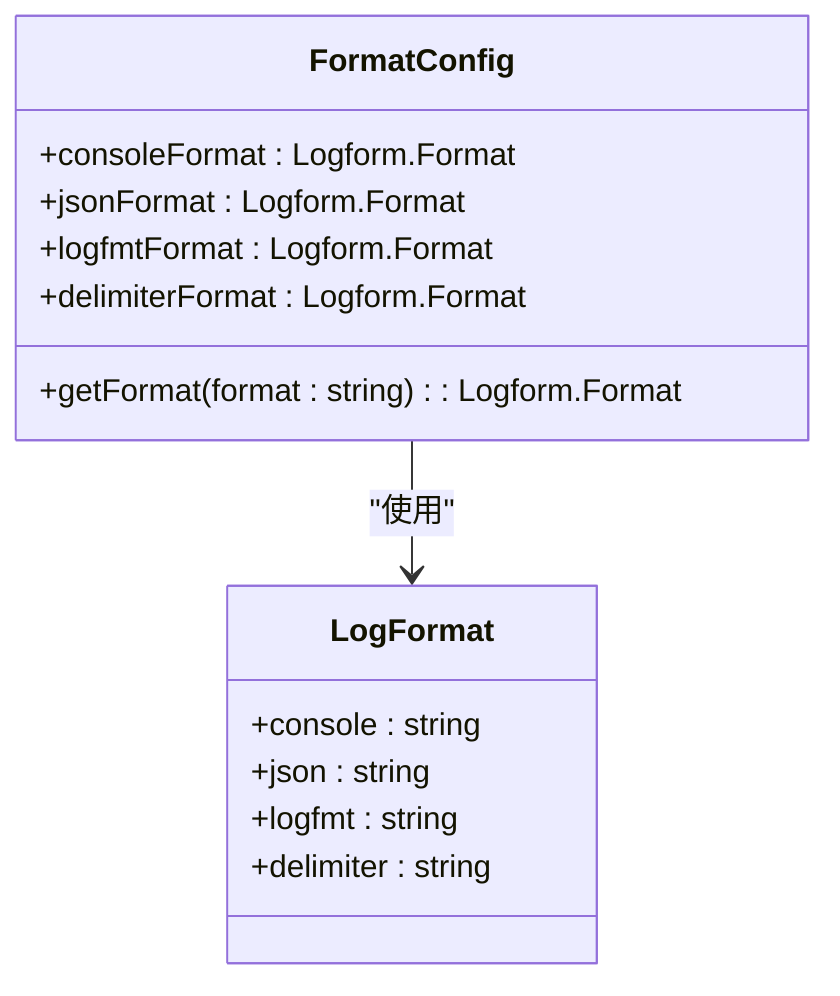
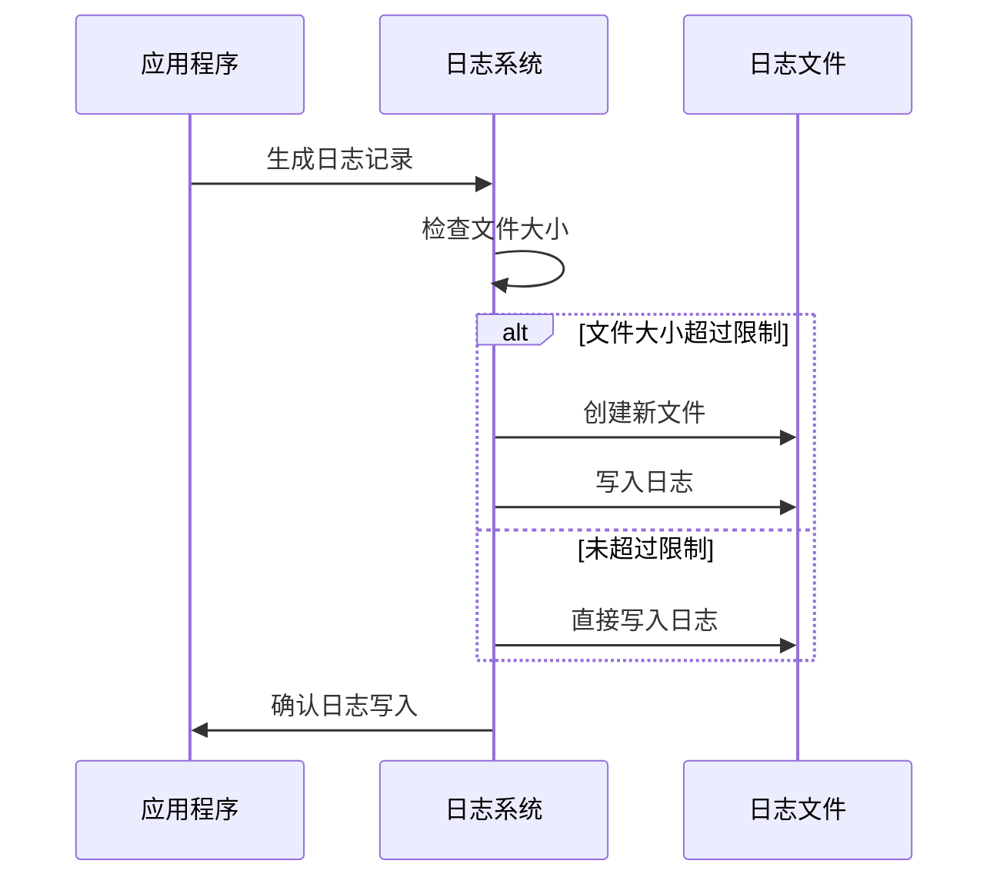
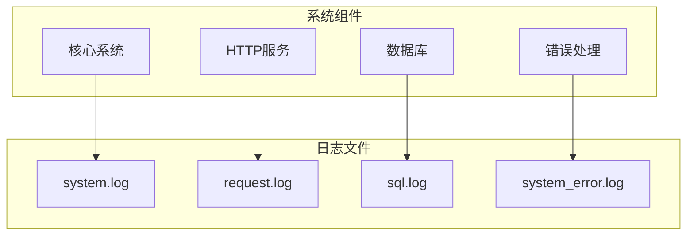
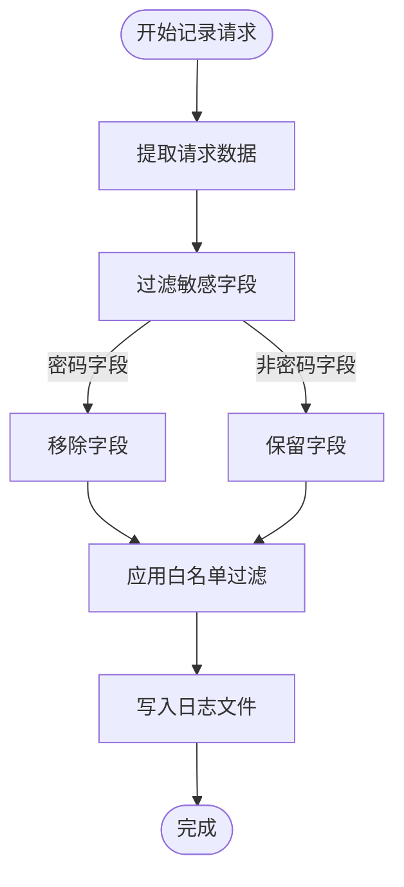
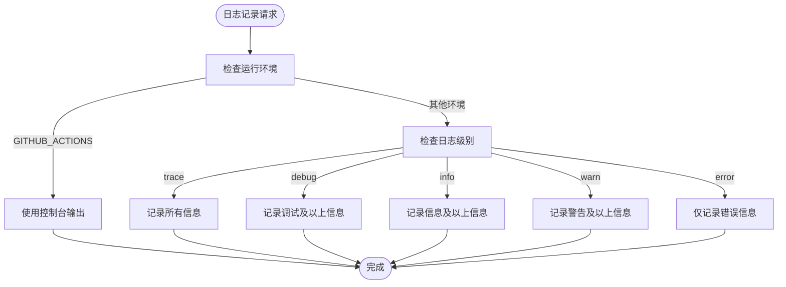
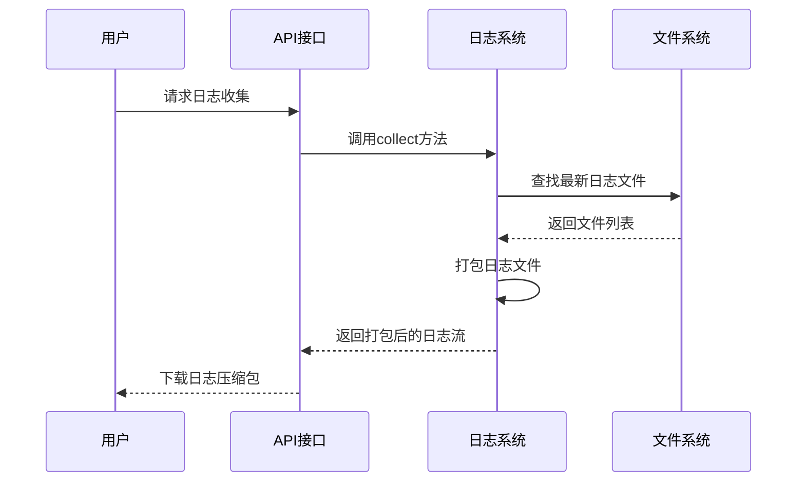
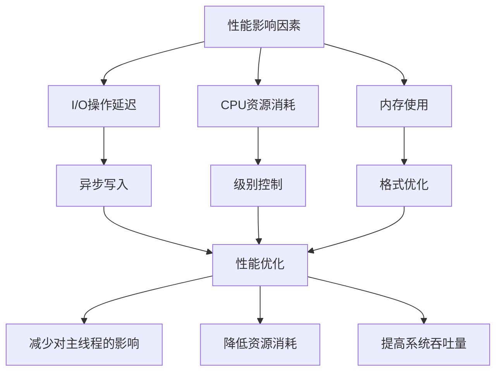
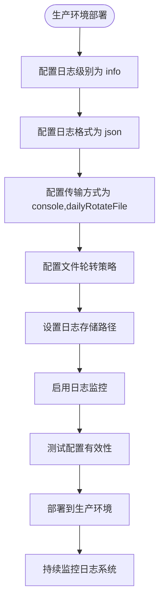
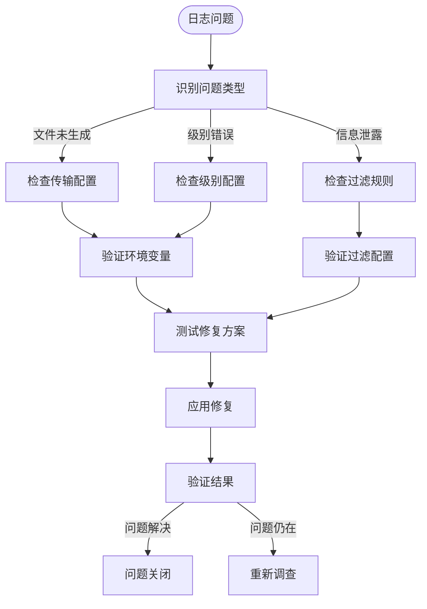

# 日志配置

<cite>
**本文档中引用的文件**  
- [config.ts](file://packages/core/logger/src/config.ts)
- [logger.ts](file://packages/core/logger/src/logger.ts)
- [format.ts](file://packages/core/logger/src/format.ts)
- [transports.ts](file://packages/core/logger/src/transports.ts)
- [system-logger.ts](file://packages/core/logger/src/system-logger.ts)
- [request-logger.ts](file://packages/core/logger/src/request-logger.ts)
- [logger.ts](file://packages/plugins/@nocobase/plugin-logger/src/server/resourcer/logger.ts)
- [error-handler.ts](file://packages/plugins/@nocobase/plugin-error-handler/src/server/error-handler.ts)
- [application.ts](file://packages/core/server/src/application.ts)
</cite>

## 目录
1. [简介](#简介)
2. [日志级别配置](#日志级别配置)
3. [日志输出格式](#日志输出格式)
4. [日志文件路径与轮转策略](#日志文件路径与轮转策略)
5. [模块化日志分离配置](#模块化日志分离配置)
6. [敏感信息过滤规则](#敏感信息过滤规则)
7. [日志采样策略](#日志采样策略)
8. [日志聚合与集中式管理](#日志聚合与集中式管理)
9. [日志性能影响与优化](#日志性能影响与优化)
10. [生产环境最佳实践](#生产环境最佳实践)
11. [常见日志问题排查](#常见日志问题排查)

## 简介
NocoBase的日志系统基于Winston日志库构建，提供了灵活的配置选项来满足不同环境下的日志记录需求。该系统支持多种日志级别、输出格式和传输方式，能够有效地帮助开发者监控应用状态、诊断问题并进行性能分析。日志系统通过环境变量进行配置，允许在不同部署环境中轻松调整日志行为。

**Section sources**
- [config.ts](file://packages/core/logger/src/config.ts#L1-L23)
- [logger.ts](file://packages/core/logger/src/logger.ts#L1-L68)

## 日志级别配置
NocoBase支持多种日志级别，包括debug、info、warn和error。日志级别的设置优先级如下：首先检查`LOGGER_LEVEL`环境变量，如果未设置，则根据`APP_ENV`环境变量的值决定默认级别。在开发环境中，默认日志级别为debug，以便提供详细的调试信息；在其他环境中，默认级别为info，以减少日志输出量。

**Diagram sources**
- [config.ts](file://packages/core/logger/src/config.ts#L12-L13)

## 日志输出格式
NocoBase支持四种日志输出格式：console、json、logfmt和delimiter。格式的选择同样通过环境变量`LOGGER_FORMAT`进行配置。在开发环境中，默认使用console格式，提供彩色输出和易读的格式；在生产环境中，默认使用json格式，便于日志聚合和分析工具处理。

**Diagram sources**
- [format.ts](file://packages/core/logger/src/format.ts#L24-L43)
- [config.ts](file://packages/core/logger/src/config.ts#L22-L23)

## 日志文件路径与轮转策略
日志文件的存储路径由`LOGGER_BASE_PATH`环境变量决定，如果未设置，则默认存储在`storage/logs`目录下。系统支持两种文件传输方式：普通文件传输和按天轮转的文件传输。轮转策略可以通过`LOGGER_MAX_SIZE`和`LOGGER_MAX_FILES`环境变量进行配置，分别控制单个日志文件的最大大小和保留的文件数量。

**Diagram sources**
- [transports.ts](file://packages/core/logger/src/transports.ts#L17-L31)
- [config.ts](file://packages/core/logger/src/config.ts#L15-L17)

## 模块化日志分离配置
NocoBase实现了模块化的日志分离机制，不同的系统组件使用独立的日志文件。主要的日志文件包括：
- system.log：系统核心组件日志
- request.log：HTTP请求日志
- sql.log：数据库查询日志
- system_error.log：系统错误日志（当启用错误分离时）

这种分离配置有助于快速定位问题来源，特别是在复杂的生产环境中。

**Diagram sources**
- [application.ts](file://packages/core/server/src/application.ts#L1230-L1239)
- [system-logger.ts](file://packages/core/logger/src/system-logger.ts#L53-L58)

## 敏感信息过滤规则
为了保护用户隐私和系统安全，NocoBase的日志系统内置了敏感信息过滤机制。在记录HTTP请求日志时，系统会自动过滤掉密码相关的字段，包括：
- params.values.password
- params.values.confirmPassword
- params.values.oldPassword
- params.values.newPassword

此外，系统还定义了请求和响应的白名单字段，只记录必要的信息，避免敏感数据泄露。

**Diagram sources**
- [request-logger.ts](file://packages/core/logger/src/request-logger.ts#L23-L28)
- [request-logger.ts](file://packages/core/logger/src/request-logger.ts#L68-L69)

## 日志采样策略
NocoBase的日志系统支持基于环境的采样策略。在GitHub Actions等CI/CD环境中，系统会自动切换到控制台日志模式，避免在测试过程中产生过多的日志文件。此外，通过设置不同的日志级别，可以实现粗粒度的日志采样控制。

**Diagram sources**
- [logger.ts](file://packages/core/logger/src/logger.ts#L36-L37)
- [config.ts](file://packages/core/logger/src/config.ts#L12-L13)

## 日志聚合与集中式管理
NocoBase提供了日志聚合和集中式管理的功能。通过`plugin-logger`插件，用户可以：
- 列出所有日志文件
- 下载指定的日志文件
- 收集诊断信息并打包最新的日志文件

这些功能特别适用于远程诊断和问题排查，管理员可以通过API接口获取系统日志而无需直接访问服务器文件系统。

**Diagram sources**
- [logger.ts](file://packages/plugins/@nocobase/plugin-logger/src/server/resourcer/logger.ts#L146-L168)
- [logger.ts](file://packages/plugins/@nocobase/plugin-logger/src/server/resourcer/logger.ts#L33-L52)

## 日志性能影响与优化
日志记录会对系统性能产生一定影响，特别是在高并发场景下。NocoBase通过以下方式优化日志性能：
1. 使用异步日志写入，避免阻塞主线程
2. 在非调试环境中降低日志级别，减少日志输出量
3. 合理配置日志轮转策略，避免频繁的文件操作
4. 在CI/CD环境中使用轻量级的日志输出模式

此外，系统还提供了中间件级别的日志采样功能，通过设置`LOGGER_LEVEL=trace`可以启用详细的中间件调用跟踪日志。

**Diagram sources**
- [wrap-middleware.ts](file://packages/core/utils/src/wrap-middleware.ts#L1-L35)
- [logger.ts](file://packages/core/logger/src/logger.ts#L43-L45)

## 生产环境最佳实践
在生产环境中配置NocoBase日志系统时，建议遵循以下最佳实践：
1. **日志级别**：设置为`info`或`warn`，避免记录过多的调试信息
2. **日志格式**：使用`json`格式，便于日志聚合和分析
3. **传输方式**：同时启用`console`和`dailyRotateFile`，确保日志既可被容器化平台收集，又有本地备份
4. **文件轮转**：合理配置`LOGGER_MAX_SIZE`（建议20MB）和`LOGGER_MAX_FILES`（建议14天）
5. **日志路径**：将`LOGGER_BASE_PATH`指向有足够磁盘空间的挂载点
6. **监控告警**：设置日志文件大小和磁盘空间的监控告警

**Section sources**
- [config.ts](file://packages/core/logger/src/config.ts#L12-L23)
- [transports.ts](file://packages/core/logger/src/transports.ts#L20-L23)
- [transports.ts](file://packages/core/logger/src/transports.ts#L27-L28)

## 常见日志问题排查
当遇到日志相关问题时，可以按照以下步骤进行排查：

### 日志文件未生成
1. 检查`LOGGER_TRANSPORT`环境变量是否包含`file`或`dailyRotateFile`
2. 确认`LOGGER_BASE_PATH`指定的目录存在且有写入权限
3. 检查磁盘空间是否充足

### 日志级别不符合预期
1. 检查`LOGGER_LEVEL`环境变量设置
2. 确认`APP_ENV`环境变量值是否正确
3. 验证配置是否在正确的环境中加载

### 敏感信息泄露
1. 检查`request-logger`的黑名单配置
2. 验证自定义插件是否正确处理了敏感数据
3. 审查API响应是否包含不应暴露的信息

**Section sources**
- [error-handler.ts](file://packages/plugins/@nocobase/plugin-error-handler/src/server/error-handler.ts#L58-L59)
- [logger.ts](file://packages/plugins/@nocobase/plugin-logger/src/server/resourcer/logger.ts#L156-L159)
- [config.ts](file://packages/core/logger/src/config.ts#L12-L13)