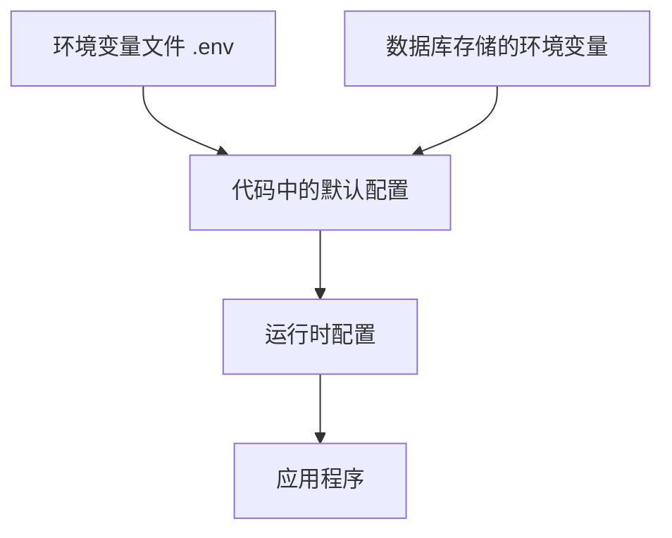
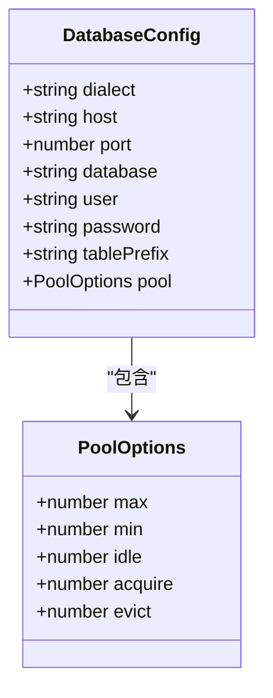
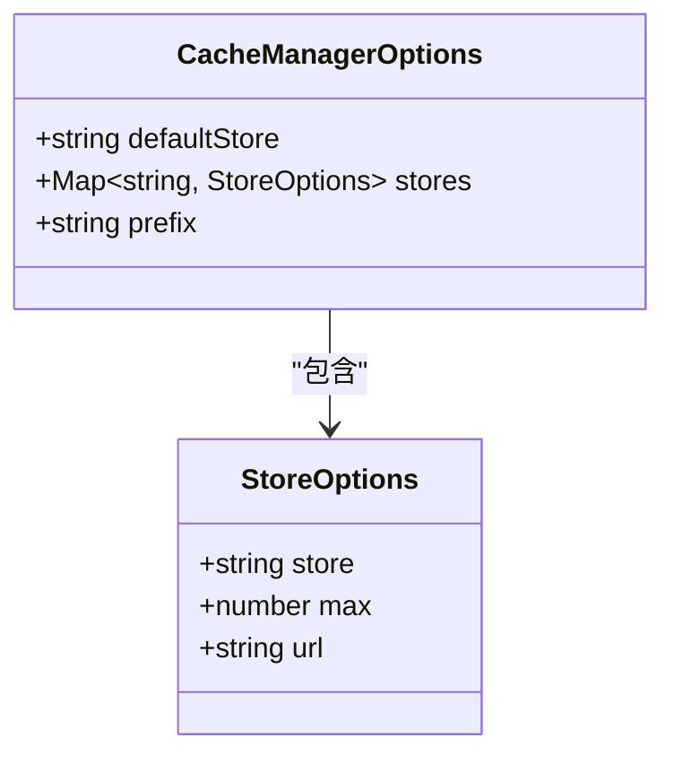
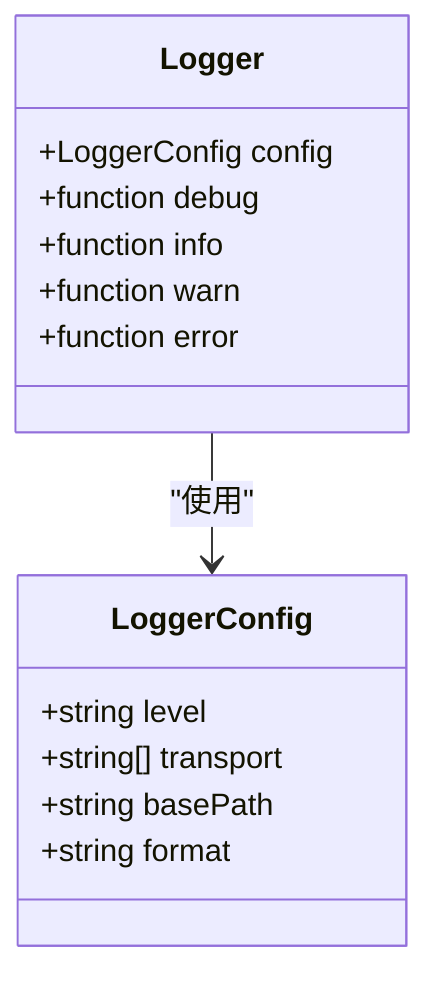
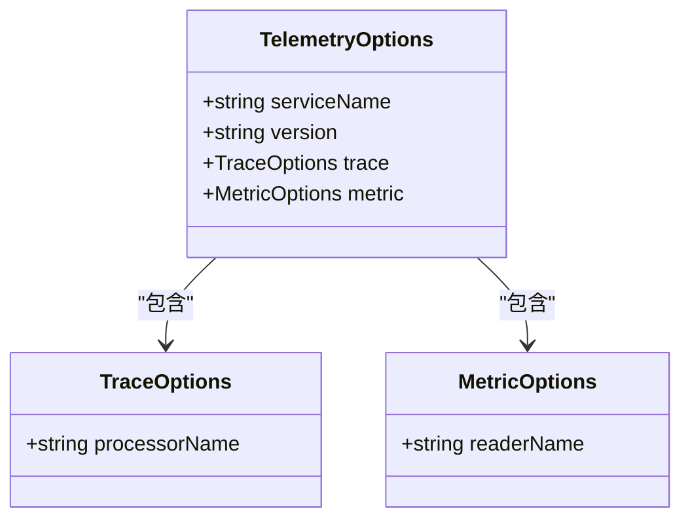
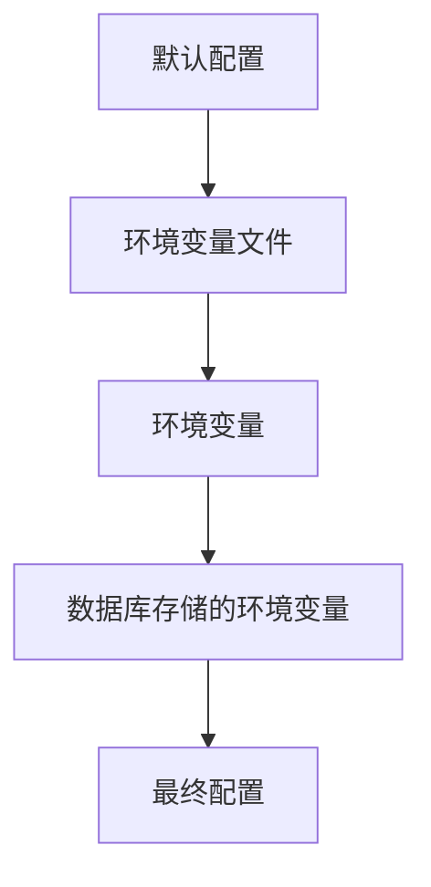
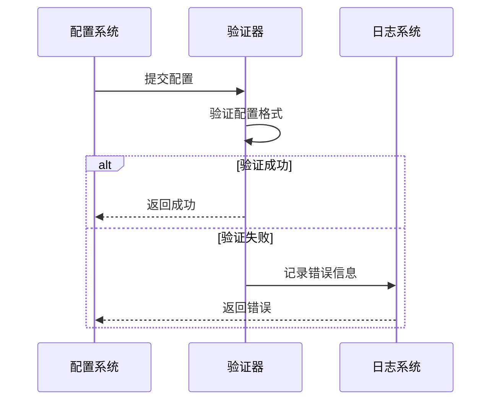

# 系统配置

<cite>
**本文档中引用的文件**  
- [.env.example](file://.env.example)
- [.env.perf.example](file://.env.perf.example)
- [packages/core/app/src/config/index.ts](file://packages/core/app/src/config/index.ts)
- [packages/core/app/src/config/cache.ts](file://packages/core/app/src/config/cache.ts)
- [packages/core/app/src/config/database.ts](file://packages/core/app/src/config/database.ts)
- [packages/core/app/src/config/logger.ts](file://packages/core/app/src/config/logger.ts)
- [packages/core/app/src/config/telemetry.ts](file://packages/core/app/src/config/telemetry.ts)
- [packages/core/database/src/database.ts](file://packages/core/database/src/database.ts)
- [packages/core/logger/src/config.ts](file://packages/core/logger/src/config.ts)
- [packages/core/cache/src/cache-manager.ts](file://packages/core/cache/src/cache-manager.ts)
- [packages/core/telemetry/src/telemetry.ts](file://packages/core/telemetry/src/telemetry.ts)
- [packages/plugins/@nocobase/plugin-environment-variables/src/server/plugin.ts](file://packages/plugins/@nocobase/plugin-environment-variables/src/server/plugin.ts)
- [packages/plugins/@nocobase/plugin-environment-variables/src/server/collections/environmentVariables.ts](file://packages/plugins/@nocobase/plugin-environment-variables/src/server/collections/environmentVariables.ts)
- [packages/plugins/@nocobase/plugin-system-settings/src/server/server.ts](file://packages/plugins/@nocobase/plugin-system-settings/src/server/server.ts)
- [packages/plugins/@nocobase/plugin-system-settings/src/client/SystemSettingsPane.tsx](file://packages/plugins/@nocobase/plugin-system-settings/src/client/SystemSettingsPane.tsx)
</cite>

## 目录
1. [引言](#引言)
2. [配置文件结构与层次](#配置文件结构与层次)
3. [核心配置项详解](#核心配置项详解)
4. [数据库连接参数](#数据库连接参数)
5. [缓存设置](#缓存设置)
6. [日志级别](#日志级别)
7. [遥测配置](#遥测配置)
8. [性能调优参数](#性能调优参数)
9. [配置加载顺序与优先级](#配置加载顺序与优先级)
10. [配置验证机制与错误处理](#配置验证机制与错误处理)
11. [生产环境最佳实践](#生产环境最佳实践)
12. [常见配置问题解决方案](#常见配置问题解决方案)
13. [结论](#结论)

## 引言

NocoBase 是一个开源的无代码/低代码平台，其系统配置机制提供了灵活且强大的方式来定制应用程序的行为。本文档深入探讨了 NocoBase 系统配置的各个方面，包括配置文件的结构、各个配置项的作用、加载顺序、验证机制以及在生产环境中的最佳实践。

NocoBase 的配置系统基于环境变量和配置文件相结合的方式，允许开发者通过多种途径进行配置，包括 `.env` 文件、环境变量、数据库存储的环境变量以及代码中的默认配置。这种多层次的配置机制确保了系统的灵活性和可扩展性。

**Section sources**
- [packages/core/app/src/config/index.ts](file://packages/core/app/src/config/index.ts#L18-L32)

## 配置文件结构与层次

NocoBase 的配置系统采用分层结构，主要由以下几个部分组成：

1. **环境变量文件**：`.env` 文件是配置的基础，包含了应用程序运行所需的各种参数。
2. **代码中的默认配置**：在代码中定义了各个模块的默认配置值，这些值可以在环境变量未设置时使用。
3. **数据库存储的环境变量**：通过 `environmentVariables` 插件，可以在数据库中存储和管理环境变量，实现动态配置。
4. **运行时配置**：应用程序启动时，会根据环境变量和配置文件生成最终的运行时配置。

配置文件的结构遵循模块化设计，每个模块都有自己的配置文件，如 `cache.ts`、`database.ts`、`logger.ts` 等，这些文件最终在 `index.ts` 中被整合成一个完整的配置对象。



**Diagram sources**
- [packages/core/app/src/config/index.ts](file://packages/core/app/src/config/index.ts#L18-L32)

**Section sources**
- [packages/core/app/src/config/index.ts](file://packages/core/app/src/config/index.ts#L18-L32)

## 核心配置项详解

NocoBase 的核心配置项涵盖了数据库连接、缓存、日志、遥测等多个方面。每个配置项都有其特定的作用和可选值，理解这些配置项对于优化系统性能和确保系统稳定运行至关重要。

### 配置项的作用与影响

配置项不仅决定了应用程序的行为，还直接影响系统的性能和安全性。例如，数据库连接池的大小会影响系统的并发处理能力，日志级别会影响系统的调试信息输出量，缓存设置会影响系统的响应速度。

### 可选值与默认值

每个配置项都有其可选值和默认值。默认值通常是为了确保应用程序在没有显式配置的情况下能够正常运行。可选值则提供了更多的灵活性，允许开发者根据具体需求进行调整。

**Section sources**
- [packages/core/app/src/config/index.ts](file://packages/core/app/src/config/index.ts#L18-L32)

## 数据库连接参数

数据库连接参数是 NocoBase 系统配置中最关键的部分之一，它们决定了应用程序如何与数据库进行交互。

### 主要参数

- **DB_DIALECT**：指定数据库类型，支持 `postgres`、`mysql`、`mariadb`、`kingbase` 等。
- **DB_HOST**：数据库服务器的主机名或 IP 地址。
- **DB_PORT**：数据库服务器的端口号。
- **DB_DATABASE**：要连接的数据库名称。
- **DB_USER**：数据库用户名。
- **DB_PASSWORD**：数据库密码。
- **DB_TABLE_PREFIX**：数据库表前缀，用于区分不同应用的表。

### 连接池设置

连接池设置对于提高数据库操作的性能至关重要。NocoBase 支持通过环境变量配置连接池参数：

- **DB_POOL_MAX**：连接池中最大连接数。
- **DB_POOL_MIN**：连接池中最小连接数。
- **DB_POOL_IDLE**：连接在池中保持空闲而不被释放的时间（毫秒）。
- **DB_POOL_ACQUIRE**：从池中获取连接的超时时间（毫秒）。
- **DB_POOL_EVICT**：从池中移除空闲连接的时间间隔（毫秒）。



**Diagram sources**
- [packages/core/database/src/database.ts](file://packages/core/database/src/database.ts#L189-L245)
- [packages/core/database/src/helpers.ts](file://packages/core/database/src/helpers.ts#L77-L86)

**Section sources**
- [packages/core/database/src/database.ts](file://packages/core/database/src/database.ts#L189-L245)
- [packages/core/database/src/helpers.ts](file://packages/core/database/src/helpers.ts#L77-L86)

## 缓存设置

缓存是提高系统性能的重要手段，NocoBase 提供了灵活的缓存配置选项。

### 缓存存储类型

NocoBase 支持多种缓存存储类型：

- **memory**：内存缓存，适用于单机部署。
- **redis**：Redis 缓存，适用于分布式部署。

### 配置参数

- **CACHE_DEFAULT_STORE**：默认缓存存储类型，可选值为 `memory` 或 `redis`。
- **CACHE_MEMORY_MAX**：内存缓存的最大条目数，默认值为 2000。
- **CACHE_REDIS_URL**：Redis 服务器的连接 URL。



**Diagram sources**
- [packages/core/app/src/config/cache.ts](file://packages/core/app/src/config/cache.ts#L13-L28)
- [packages/core/cache/src/cache-manager.ts](file://packages/core/cache/src/cache-manager.ts#L28-L86)

**Section sources**
- [packages/core/app/src/config/cache.ts](file://packages/core/app/src/config/cache.ts#L13-L28)
- [packages/core/cache/src/cache-manager.ts](file://packages/core/cache/src/cache-manager.ts#L28-L86)

## 日志级别

日志是系统调试和监控的重要工具，NocoBase 提供了详细的日志配置选项。

### 日志级别

- **error**：仅记录错误信息。
- **warn**：记录警告和错误信息。
- **info**：记录一般信息、警告和错误信息。
- **debug**：记录调试信息及更高级别的信息。
- **trace**：记录跟踪信息及更高级别的信息。

### 配置参数

- **LOGGER_LEVEL**：日志级别，可选值为 `error`、`warn`、`info`、`debug`、`trace`。
- **LOGGER_TRANSPORT**：日志输出方式，可选值为 `console`、`file`、`dailyRotateFile`。
- **LOGGER_BASE_PATH**：日志文件的存储路径。
- **LOGGER_FORMAT**：日志格式，可选值为 `console`、`json`、`logfmt`、`delimiter`。



**Diagram sources**
- [packages/core/app/src/config/logger.ts](file://packages/core/app/src/config/logger.ts)
- [packages/core/logger/src/config.ts](file://packages/core/logger/src/config.ts#L12-L24)

**Section sources**
- [packages/core/app/src/config/logger.ts](file://packages/core/app/src/config/logger.ts)
- [packages/core/logger/src/config.ts](file://packages/core/logger/src/config.ts#L12-L24)

## 遥测配置

遥测配置用于收集和分析系统的运行数据，帮助开发者了解系统的性能和使用情况。

### 配置参数

- **TELEMETRY_ENABLED**：是否启用遥测功能，可选值为 `on` 或 `off`。
- **TELEMETRY_METRIC_READER**：指标读取器，可选值为 `console`、`prometheus` 等。
- **TELEMETRY_TRACE_PROCESSOR**：跟踪处理器，可选值为 `console`、`zipkin`、`jaeger` 等。



**Diagram sources**
- [packages/core/app/src/config/telemetry.ts](file://packages/core/app/src/config/telemetry.ts#L12-L20)
- [packages/core/telemetry/src/telemetry.ts](file://packages/core/telemetry/src/telemetry.ts#L16-L71)

**Section sources**
- [packages/core/app/src/config/telemetry.ts](file://packages/core/app/src/config/telemetry.ts#L12-L20)
- [packages/core/telemetry/src/telemetry.ts](file://packages/core/telemetry/src/telemetry.ts#L16-L71)

## 性能调优参数

性能调优参数用于优化系统的运行效率，确保系统在高负载下仍能稳定运行。

### 主要参数

- **CLUSTER_MODE**：集群模式，用于启动应用程序的集群模式。
- **WORKER_MODE**：工作模式，用于指定服务器处理请求和后台任务的方式。
- **APP_ENV**：应用环境，可选值为 `development`、`production` 等。

### 配置示例

```env
CLUSTER_MODE=2
WORKER_MODE=!
APP_ENV=production
```

**Section sources**
- [.env.example](file://.env.example#L32-L44)

## 配置加载顺序与优先级

NocoBase 的配置加载遵循一定的顺序和优先级规则，确保配置的一致性和正确性。

### 加载顺序

1. **默认配置**：代码中定义的默认配置。
2. **环境变量文件**：`.env` 文件中的配置。
3. **环境变量**：操作系统环境变量。
4. **数据库存储的环境变量**：通过 `environmentVariables` 插件存储在数据库中的配置。

### 优先级规则

配置的优先级从低到高依次为：默认配置 < 环境变量文件 < 环境变量 < 数据库存储的环境变量。这意味着，如果同一配置项在多个地方被定义，优先级高的配置将覆盖优先级低的配置。



**Diagram sources**
- [packages/core/app/src/config/index.ts](file://packages/core/app/src/config/index.ts#L18-L32)
- [packages/plugins/@nocobase/plugin-environment-variables/src/server/plugin.ts](file://packages/plugins/@nocobase/plugin-environment-variables/src/server/plugin.ts#L34-L216)

**Section sources**
- [packages/core/app/src/config/index.ts](file://packages/core/app/src/config/index.ts#L18-L32)
- [packages/plugins/@nocobase/plugin-environment-variables/src/server/plugin.ts](file://packages/plugins/@nocobase/plugin-environment-variables/src/server/plugin.ts#L34-L216)

## 配置验证机制与错误处理

NocoBase 提供了配置验证机制，确保配置的正确性和完整性。

### 验证机制

- **环境变量格式验证**：确保环境变量的格式正确，如 `KEY=VALUE`。
- **必填项验证**：确保必要的配置项已设置。
- **值范围验证**：确保配置项的值在允许的范围内。

### 错误处理

当配置验证失败时，NocoBase 会抛出相应的错误，并记录详细的错误信息，帮助开发者快速定位问题。



**Diagram sources**
- [packages/plugins/@nocobase/plugin-environment-variables/src/server/plugin.ts](file://packages/plugins/@nocobase/plugin-environment-variables/src/server/plugin.ts#L54-L96)

**Section sources**
- [packages/plugins/@nocobase/plugin-environment-variables/src/server/plugin.ts](file://packages/plugins/@nocobase/plugin-environment-variables/src/server/plugin.ts#L54-L96)

## 生产环境最佳实践

在生产环境中，合理的配置对于系统的稳定性和性能至关重要。

### 安全性

- **使用安全的数据库连接**：启用 SSL 连接，保护数据传输的安全。
- **限制日志输出**：避免在生产环境中输出过多的调试信息，防止敏感信息泄露。

### 性能优化

- **合理设置连接池**：根据实际负载调整连接池的大小，避免资源浪费。
- **启用缓存**：使用 Redis 缓存，提高系统的响应速度。

### 监控与维护

- **启用遥测**：收集系统运行数据，及时发现和解决问题。
- **定期备份**：定期备份数据库，防止数据丢失。

**Section sources**
- [.env.example](file://.env.example)
- [packages/core/app/src/config/index.ts](file://packages/core/app/src/config/index.ts)

## 常见配置问题解决方案

### 数据库连接失败

- **检查数据库服务是否运行**：确保数据库服务已启动。
- **检查连接参数**：确认 `DB_HOST`、`DB_PORT`、`DB_USER`、`DB_PASSWORD` 等参数正确无误。
- **检查网络连接**：确保应用程序服务器能够访问数据库服务器。

### 缓存不生效

- **检查缓存配置**：确认 `CACHE_DEFAULT_STORE` 和 `CACHE_REDIS_URL` 等参数正确。
- **检查 Redis 服务**：确保 Redis 服务已启动且可访问。

### 日志未输出

- **检查日志级别**：确认 `LOGGER_LEVEL` 设置正确。
- **检查日志输出方式**：确认 `LOGGER_TRANSPORT` 设置正确。

**Section sources**
- [.env.example](file://.env.example)
- [packages/core/app/src/config/logger.ts](file://packages/core/app/src/config/logger.ts)

## 结论

NocoBase 的系统配置机制提供了灵活且强大的方式来定制应用程序的行为。通过合理配置数据库连接、缓存、日志、遥测等参数，可以显著提升系统的性能和稳定性。在生产环境中，遵循最佳实践，确保系统的安全性和可靠性。