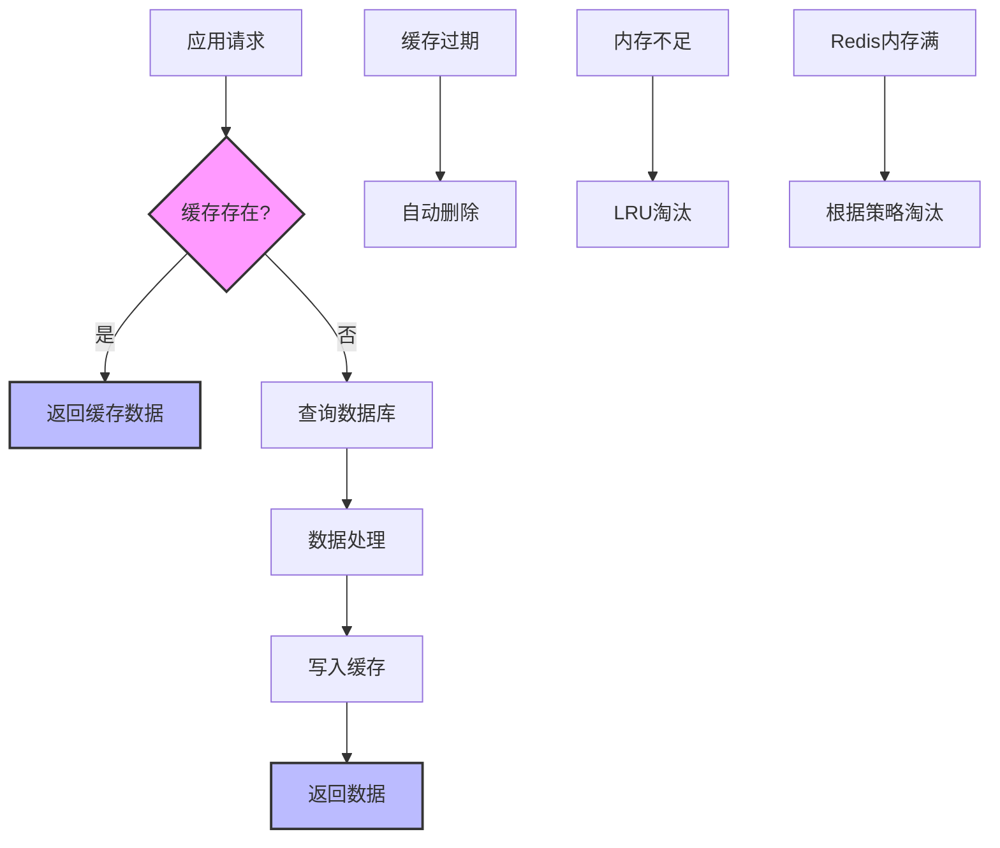

# 缓存配置

<cite>
**本文档中引用的文件**  
- [cache.ts](file://packages/core/cache/src/cache.ts)
- [cache-manager.ts](file://packages/core/cache/src/cache-manager.ts)
- [memory-counter.ts](file://packages/core/cache/src/counter/memory-counter.ts)
- [redis-counter.ts](file://packages/core/cache/src/counter/redis-counter.ts)
- [lock-counter.ts](file://packages/core/cache/src/counter/lock-counter.ts)
- [memory-bloom-filter.ts](file://packages/core/cache/src/bloom-filter/memory-bloom-filter.ts)
- [redis-bloom-filter.ts](file://packages/core/cache/src/bloom-filter/redis-bloom-filter.ts)
- [cache.ts](file://packages/core/app/src/config/cache.ts)
- [index.ts](file://packages/core/server/src/cache/index.ts)
</cite>

## 目录
1. [缓存系统概述](#缓存系统概述)
2. [缓存类型与配置](#缓存类型与配置)
3. [缓存过期策略](#缓存过期策略)
4. [缓存键命名规则](#缓存键命名规则)
5. [缓存大小限制](#缓存大小限制)
6. [缓存预热策略](#缓存预热策略)
7. [缓存穿透与雪崩防护](#缓存穿透与雪崩防护)
8. [分布式缓存一致性](#分布式缓存一致性)
9. [缓存监控与性能指标](#缓存监控与性能指标)
10. [最佳实践与性能诊断](#最佳实践与性能诊断)

## 缓存系统概述

NocoBase的缓存系统提供了灵活的缓存管理机制，支持内存缓存和Redis缓存两种存储方式。系统通过CacheManager类统一管理缓存实例，提供了一致的API接口。缓存系统不仅支持基本的get/set操作，还提供了原子计数器、布隆过滤器等高级功能，以满足不同场景下的需求。

缓存系统的设计遵循模块化原则，核心功能分布在多个文件中：`cache-manager.ts`负责缓存管理器的创建和配置，`cache.ts`定义了缓存的基本操作接口，而各种具体的实现类则分布在counter和bloom-filter目录中。

**Section sources**
- [cache-manager.ts](file://packages/core/cache/src/cache-manager.ts#L1-L200)
- [cache.ts](file://packages/core/cache/src/cache.ts#L1-L116)

## 缓存类型与配置

NocoBase支持两种缓存类型：内存缓存和Redis缓存。缓存类型通过环境变量进行配置，系统默认使用内存缓存。

### 内存缓存配置

内存缓存是NocoBase的默认缓存类型，配置简单且无需外部依赖。在`packages/core/app/src/config/cache.ts`文件中，通过以下代码配置内存缓存：

```typescript
const redisURL = process.env.REDIS_URL || process.env.CACHE_REDIS_URL;
export const cacheManager: CacheManagerOptions = {
  defaultStore: process.env.CACHE_DEFAULT_STORE || 'memory',
  stores: {
    memory: {
      store: 'memory',
      max: parseInt(process.env.CACHE_MEMORY_MAX) || 2000,
    },
    ...(redisURL
      ? {
          redis: {
            url: redisURL,
          },
        }
      : {}),
  },
};
```

内存缓存的主要配置参数包括：
- `max`: 缓存项的最大数量，默认为2000
- `store`: 存储类型，固定为'memory'

### Redis缓存配置

Redis缓存提供了分布式缓存能力，适合多实例部署场景。Redis缓存通过环境变量`REDIS_URL`或`CACHE_REDIS_URL`进行配置。当检测到Redis URL时，系统会自动启用Redis缓存存储。

Redis缓存配置的主要特点：
- 支持标准的Redis连接URL格式
- 自动处理连接的建立和关闭
- 提供与内存缓存一致的API接口

```mermaid
classDiagram
class CacheManager {
+defaultStore : string
+prefix? : string
+stores : Map<string, {store : BasicCache, close? : Function}>
+storeTypes : Map<string, StoreOptions>
+caches : Map<string, Cache>
+constructor(options? : CacheManagerOptions)
+createCache(options : CacheOptions) : Promise<Cache>
+getCache(name : string) : Cache
+flushAll() : Promise<void>
+close() : Promise<void>
}
class Cache {
+name : string
+prefix? : string
+store : BasicCache
+constructor(options : {name : string, prefix? : string, store : BasicCache})
+key(key : string) : string
+set(key : string, value : any, ttl? : number) : Promise<void>
+get<T>(key : string) : Promise<T>
+del(key : string) : Promise<void>
+reset() : Promise<void>
+wrap<T>(key : string, fn : Function, ttl? : number) : Promise<T>
}
class StoreOptions {
+store? : 'memory' | FactoryStore
+close? : (store : Store) => Promise<void>
}
class CacheManagerOptions {
+defaultStore : string
+stores : { [storeType : string] : StoreOptions }
+prefix : string
}
CacheManager --> Cache : "创建"
CacheManager --> StoreOptions : "使用"
CacheManager --> CacheManagerOptions : "接受"
Cache --> BasicCache : "包装"
```

**Diagram sources**
- [cache-manager.ts](file://packages/core/cache/src/cache-manager.ts#L36-L200)
- [cache.ts](file://packages/core/cache/src/cache.ts#L12-L116)

**Section sources**
- [cache.ts](file://packages/core/app/src/config/cache.ts#L12-L28)

## 缓存过期策略

NocoBase的缓存系统支持灵活的过期策略，允许为每个缓存项设置不同的生存时间（TTL）。过期策略的实现依赖于底层缓存存储的特性。

### 内存缓存过期

内存缓存使用JavaScript的setTimeout机制实现过期功能。在`memory-counter.ts`文件中，可以看到具体的实现：

```typescript
class Cache {
  data = new Map();
  timers = new Map();

  set(k: string, v: any, ttl?: number) {
    if (ttl) {
      if (this.timers.has(k)) {
        clearTimeout(this.timers.get(k));
      }
      this.timers.set(
        k,
        setTimeout(() => this.del(k), ttl),
      );
    }
    this.data.set(k, v);
  }
}
```

当设置缓存项时，如果指定了TTL，则会创建一个定时器，在指定时间后自动删除该缓存项。

### Redis缓存过期

Redis缓存利用Redis原生的过期机制。在`redis-counter.ts`文件中，通过Redis的PEXPIRE命令实现精确的毫秒级过期控制：

```typescript
const script = `
local key = KEYS[1]
local value = tonumber(ARGV[1]) or 1
local ttl = tonumber(ARGV[2])
local current = redis.call('INCRBY', key, value)
if tonumber(current) == value and ttl then
  redis.call('PEXPIRE', key, ttl)
end
return current
`;
```

这种实现方式确保了过期操作的原子性，避免了竞态条件。

### 通用过期接口

NocoBase为开发者提供了统一的过期设置接口，无论使用哪种缓存类型，都可以通过相同的方法设置过期时间：

```typescript
async set(key: string, value: unknown, ttl?: Milliseconds): Promise<void>
async wrap<T>(key: string, fn: () => Promise<T>, ttl?: Milliseconds): Promise<T>
```

**Section sources**
- [memory-counter.ts](file://packages/core/cache/src/counter/memory-counter.ts#L19-L28)
- [redis-counter.ts](file://packages/core/cache/src/counter/redis-counter.ts#L14-L23)

## 缓存键命名规则

NocoBase的缓存系统实现了统一的键命名规则，确保缓存键的唯一性和可读性。

### 前缀机制

系统支持全局前缀和实例前缀的双重前缀机制。在`cache.ts`文件中，`key`方法实现了前缀添加逻辑：

```typescript
key(key: string): string {
  return this.prefix ? `${this.prefix}:${key}` : key;
}
```

前缀的优先级顺序为：实例前缀 > 全局前缀。这种设计允许在不同层次上对缓存键进行组织和隔离。

### 键命名约定

NocoBase推荐使用以下格式的缓存键命名：

```
[前缀]:[模块名]:[实体名]:[操作]:[参数]
```

例如：
- `nocobase:users:profile:user123`
- `app:permissions:role:admin:resources`

这种命名约定有助于快速识别缓存项的用途和所属模块。

### 键冲突避免

为避免键冲突，系统在`keys`方法中实现了键的清理：

```typescript
async keys(pattern?: string): Promise<string[]> {
  const keys = await this.store.store.keys(pattern);
  return keys.map((key) => key.replace(`${this.name}:`, ''));
}
```

该方法在返回键列表时会移除实例名称前缀，确保返回的键是相对路径。

**Section sources**
- [cache.ts](file://packages/core/cache/src/cache.ts#L23-L25)
- [cache.ts](file://packages/core/cache/src/cache.ts#L90-L92)

## 缓存大小限制

NocoBase的缓存系统对不同类型的缓存实施了相应的大小限制策略。

### 内存缓存限制

内存缓存通过`max`参数限制缓存项的最大数量。在`cache-manager.ts`中，默认配置为2000个缓存项：

```typescript
memory: {
  store: 'memory',
  max: 2000,
}
```

这个限制有助于防止内存泄漏，确保系统稳定性。当缓存达到上限时，底层的缓存库会自动淘汰最久未使用的项（LRU策略）。

### Redis缓存限制

Redis缓存的大小限制由Redis服务器本身的配置决定。NocoBase通过连接参数间接影响缓存大小：

- `maxmemory`: Redis实例的最大内存使用量
- `maxmemory-policy`: 内存达到上限时的淘汰策略

系统建议根据实际部署环境合理配置这些参数。

### 多级缓存策略

NocoBase支持创建多个缓存实例，实现多级缓存策略：

```typescript
async createCache(options: { name: string; prefix?: string; store?: string; [key: string]: any })
```

通过`createCache`方法，可以为不同用途创建独立的缓存实例，实现精细化的内存管理。



**Diagram sources**
- [cache-manager.ts](file://packages/core/cache/src/cache-manager.ts#L109-L123)
- [cache.ts](file://packages/core/cache/src/cache.ts#L27-L29)

**Section sources**
- [cache-manager.ts](file://packages/core/cache/src/cache-manager.ts#L59-L63)

## 缓存预热策略

NocoBase的缓存预热策略主要通过应用启动时的初始化过程实现。

### 启动时预热

在`packages/core/server/src/cache/index.ts`文件中，可以看到缓存管理器的创建过程：

```typescript
export const createCacheManager = async (app: Application, options: CacheManagerOptions) => {
  const cacheManager = new CacheManager(options);
  const defaultCache = await cacheManager.createCache({ name: app.name });
  app.cache = defaultCache;
  app.context.cache = defaultCache;
  return cacheManager;
};
```

这个过程在应用启动时自动创建默认缓存实例，实现基本的缓存预热。

### 按需预热

系统提供了`wrap`方法支持按需预热：

```typescript
async wrap<T>(key: string, fn: () => Promise<T>, ttl?: Milliseconds): Promise<T>
```

该方法在缓存未命中时自动执行提供的函数，并将结果存入缓存，实现懒加载式的预热。

### 批量预热

通过`mset`方法支持批量预热：

```typescript
async mset(args: [string, unknown][], ttl?: Milliseconds): Promise<void>
```

可以一次性设置多个缓存项，提高预热效率。

**Section sources**
- [index.ts](file://packages/core/server/src/cache/index.ts#L13-L19)
- [cache.ts](file://packages/core/cache/src/cache.ts#L43-L45)

## 缓存穿透与雪崩防护

NocoBase通过多种机制防护缓存穿透和雪崩问题。

### 缓存穿透防护

缓存穿透是指查询不存在的数据，导致每次请求都穿透到数据库。NocoBase通过以下方式防护：

1. **空值缓存**: 对于查询结果为空的情况，也进行缓存，设置较短的过期时间
2. **布隆过滤器**: 使用布隆过滤器快速判断数据是否存在

在`redis-bloom-filter.ts`中，实现了Redis布隆过滤器：

```typescript
async exists(key: string, value: string) {
  return this.store.client.bf.exists(key, value);
}
```

### 缓存雪崩防护

缓存雪崩是指大量缓存同时失效，导致数据库压力骤增。防护措施包括：

1. **随机过期时间**: 在基础过期时间上增加随机偏移
2. **多级缓存**: 结合内存缓存和Redis缓存，降低单点失效风险
3. **熔断机制**: 当数据库压力过大时，暂时拒绝部分请求

### 原子操作保障

对于计数器等需要原子操作的场景，系统提供了专门的实现：

```mermaid
sequenceDiagram
participant Client as "客户端"
participant Cache as "缓存系统"
participant Redis as "Redis服务器"
Client->>Cache : incr(key, ttl)
activate Cache
Cache->>Redis : scriptLoad(脚本)
activate Redis
Redis-->>Cache : 脚本SHA1
deactivate Redis
Cache->>Redis : evalSha(脚本SHA1, key, value, ttl)
Redis-->>Cache : 新值
deactivate Redis
Cache-->>Client : 返回新值
deactivate Cache
Note over Cache,Redis : 使用Lua脚本确保INCRBY和PEXPIRE的原子性
```

**Diagram sources**
- [redis-counter.ts](file://packages/core/cache/src/counter/redis-counter.ts#L47-L55)
- [redis-bloom-filter.ts](file://packages/core/cache/src/bloom-filter/redis-bloom-filter.ts#L47-L49)

**Section sources**
- [redis-counter.ts](file://packages/core/cache/src/counter/redis-counter.ts#L47-L56)
- [redis-bloom-filter.ts](file://packages/core/cache/src/bloom-filter/redis-bloom-filter.ts#L47-L49)

## 分布式缓存一致性

在分布式环境下，NocoBase通过Redis实现缓存一致性。

### Redis作为单一数据源

当配置了Redis缓存时，所有应用实例都连接到同一个Redis服务器，确保缓存数据的一致性：

```typescript
redis: {
  url: redisURL,
}
```

### 缓存失效同步

通过`flushAll`方法实现缓存批量失效：

```typescript
async flushAll() {
  const promises = [];
  for (const cache of this.caches.values()) {
    promises.push(cache.reset());
  }
  await Promise.all(promises);
}
```

### 分布式锁

对于需要强一致性的操作，系统提供了基于Redis的分布式锁：

```typescript
async incrby(key: string, value: number, ttl?: number) {
  const lockKey = `lock:${key}`;
  const release = await this.lockManager.acquire(lockKey, 3000);
  try {
    // 原子操作
  } finally {
    await release();
  }
}
```

**Section sources**
- [cache-manager.ts](file://packages/core/cache/src/cache-manager.ts#L133-L139)
- [lock-counter.ts](file://packages/core/cache/src/counter/lock-counter.ts#L33-L46)

## 缓存监控与性能指标

NocoBase提供了基本的缓存监控能力。

### 内置监控方法

系统提供了多个监控相关的方法：

```typescript
async keys(pattern?: string): Promise<string[]>
async ttl(key: string): Promise<number>
async mget(...args: string[]): Promise<unknown[]>
```

这些方法可以用于监控缓存状态和性能。

### 性能指标收集

通过以下方式收集性能指标：

1. **命中率**: 通过get操作的频率和结果统计
2. **响应时间**: 记录缓存操作的执行时间
3. **内存使用**: 监控Redis内存使用情况

### 监控集成

建议将缓存监控与外部监控系统集成，通过定期调用`keys`和`ttl`方法获取缓存状态。

**Section sources**
- [cache.ts](file://packages/core/cache/src/cache.ts#L90-L97)

## 最佳实践与性能诊断

### 配置最佳实践

1. **生产环境使用Redis**: 避免单点故障，支持分布式部署
2. **合理设置过期时间**: 根据数据更新频率设置合适的TTL
3. **使用前缀隔离**: 不同模块使用不同的前缀，避免键冲突

### 性能问题诊断

常见性能问题及诊断方法：

1. **缓存命中率低**
   - 检查缓存键命名是否合理
   - 分析访问模式，优化缓存策略

2. **内存使用过高**
   - 检查是否有大对象缓存
   - 调整max参数或使用Redis

3. **响应延迟高**
   - 检查Redis网络连接
   - 分析慢查询日志

### 性能优化建议

1. **批量操作**: 使用mset/mget进行批量读写
2. **压缩大对象**: 对大型JSON对象进行压缩后再缓存
3. **分层缓存**: 热点数据使用内存缓存，冷数据使用Redis

```mermaid
erDiagram
CACHE_MANAGER ||--o{ CACHE : "管理"
CACHE ||--o{ CACHE_ITEM : "包含"
CACHE_ITEM ||--o{ TTL : "具有"
CACHE_MANAGER }|--|| REDIS_STORE : "可使用"
CACHE_MANAGER }|--|| MEMORY_STORE : "可使用"
CACHE }|--|| BLOOM_FILTER : "可创建"
CACHE }|--|| COUNTER : "可创建"
class CACHE_MANAGER {
defaultStore
prefix
}
class CACHE {
name
prefix
}
class CACHE_ITEM {
key
value
ttl
}
class TTL {
expirationTime
autoCleanup
}
class REDIS_STORE {
url
connectionPool
}
class MEMORY_STORE {
maxItems
lruEviction
}
class BLOOM_FILTER {
falsePositiveRate
capacity
}
class COUNTER {
atomicIncrement
threadSafe
}
```

**Diagram sources**
- [cache-manager.ts](file://packages/core/cache/src/cache-manager.ts#L36-L200)
- [cache.ts](file://packages/core/cache/src/cache.ts#L12-L116)

**Section sources**
- [cache-manager.ts](file://packages/core/cache/src/cache-manager.ts#L109-L123)
- [cache.ts](file://packages/core/cache/src/cache.ts#L73-L88)