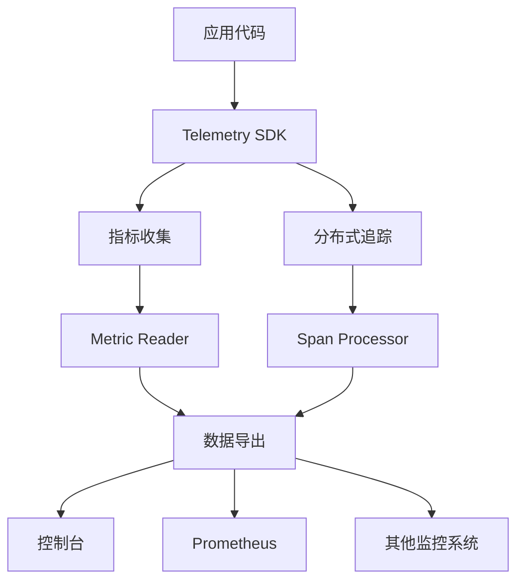
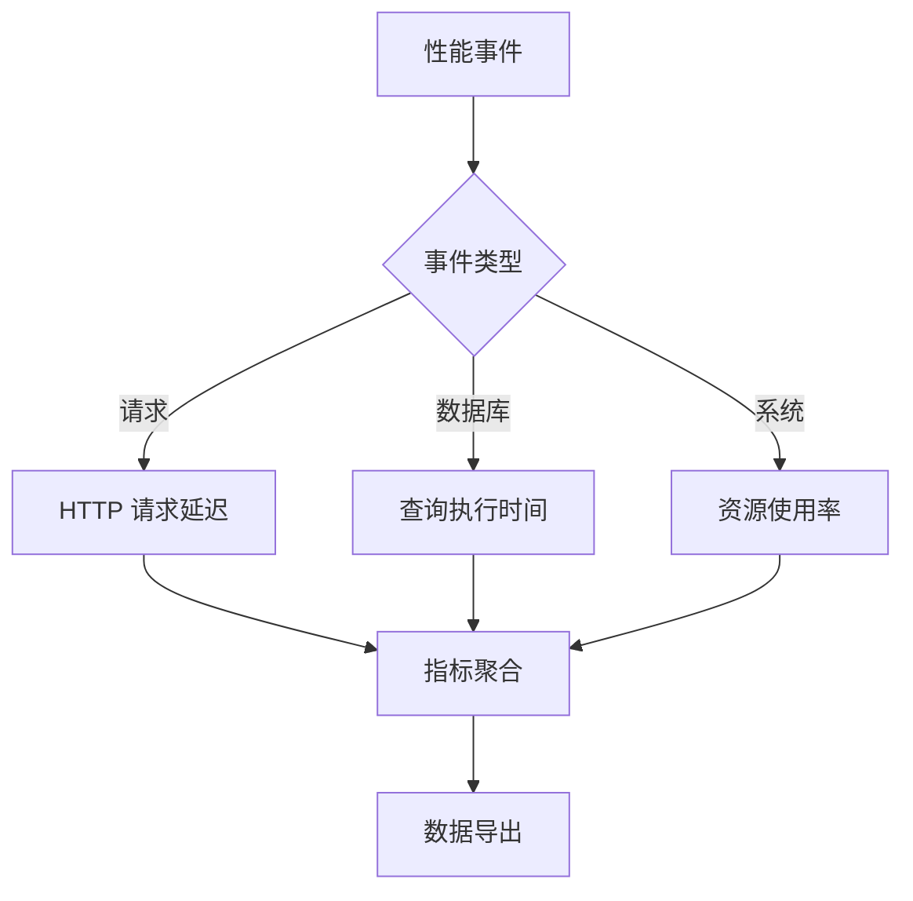
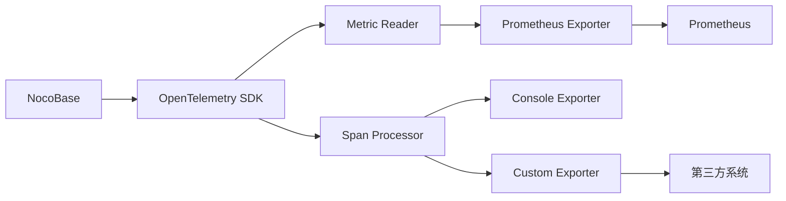

# 遥测配置

<cite>
**本文档中引用的文件**  
- [telemetry.ts](file://packages/core/telemetry/src/telemetry.ts)
- [metric.ts](file://packages/core/telemetry/src/metric.ts)
- [trace.ts](file://packages/core/telemetry/src/trace.ts)
- [telemetry.ts](file://packages/core/app/src/config/telemetry.ts)
- [application.ts](file://packages/core/server/src/application.ts)
- [.env.example](file://.env.example)
</cite>

## 目录
1. [引言](#引言)
2. [遥测系统架构](#遥测系统架构)
3. [核心配置选项](#核心配置选项)
4. [性能监控配置](#性能监控配置)
5. [错误追踪配置](#错误追踪配置)
6. [用户行为分析配置](#用户行为分析配置)
7. [数据导出与第三方集成](#数据导出与第三方集成)
8. [数据存储策略与成本控制](#数据存储策略与成本控制)
9. [生产环境最佳实践](#生产环境最佳实践)
10. [常见问题解决方案](#常见问题解决方案)

## 引言

NocoBase 的遥测系统基于 OpenTelemetry 构建，提供全面的性能监控、错误追踪和用户行为分析功能。该系统允许开发者通过环境变量和配置文件灵活控制遥测数据的收集、处理和上报行为。本文档详细说明遥测系统的各项配置选项，包括指标收集频率、追踪采样率、事件上报间隔、数据脱敏规则和隐私保护设置。

**Section sources**
- [telemetry.ts](file://packages/core/telemetry/src/telemetry.ts#L1-L71)
- [application.ts](file://packages/core/server/src/application.ts#L107-L147)

## 遥测系统架构

NocoBase 遥测系统采用分层架构设计，包含指标（Metrics）、追踪（Tracing）和日志（Logging）三个核心组件。系统基于 OpenTelemetry SDK 实现，支持多种数据导出器和处理器。



**Diagram sources**
- [telemetry.ts](file://packages/core/telemetry/src/telemetry.ts#L23-L71)
- [metric.ts](file://packages/core/telemetry/src/metric.ts#L29-L86)
- [trace.ts](file://packages/core/telemetry/src/trace.ts#L23-L71)

## 核心配置选项

### 遥测启用控制

通过环境变量控制遥测系统的启用状态：

```env
TELEMETRY_ENABLED=on
```

该配置在 `packages/core/app/src/config/telemetry.ts` 中定义，通过布尔值控制是否启动遥测功能。

### 指标收集配置

指标收集系统支持多种读取器（Reader），可通过环境变量配置：

```env
TELEMETRY_METRIC_READER=console,prometheus
```

系统支持的指标读取器包括：
- console：控制台输出
- prometheus：Prometheus 导出器
- 其他自定义读取器

### 追踪采样配置

分布式追踪系统支持多种处理器（Processor），可通过环境变量配置：

```env
TELEMETRY_TRACE_PROCESSOR=console,batch
```

系统支持的追踪处理器包括：
- console：控制台输出
- batch：批处理导出
- 其他自定义处理器

**Section sources**
- [telemetry.ts](file://packages/core/telemetry/src/telemetry.ts#L16-L21)
- [metric.ts](file://packages/core/telemetry/src/metric.ts#L21-L25)
- [trace.ts](file://packages/core/telemetry/src/trace.ts#L15-L19)
- [telemetry.ts](file://packages/core/app/src/config/telemetry.ts#L13-L19)

## 性能监控配置

### 指标收集频率

指标收集频率由 Metric Reader 的配置决定。对于 PeriodicExportingMetricReader，可以配置导出间隔：

```typescript
new PeriodicExportingMetricReader({
  exporter: new ConsoleMetricExporter(),
  exportIntervalMillis: 60000, // 每60秒导出一次
  exportTimeoutMillis: 30000
})
```

默认导出间隔为 60 秒，可通过自定义 Metric Reader 配置进行调整。

### 性能监控指标类型

系统收集的性能指标包括：
- 请求处理时间
- 数据库查询性能
- 内存使用情况
- CPU 使用率
- 缓存命中率

这些指标通过 OpenTelemetry 的 Meter API 收集，并可通过 View 配置进行聚合和过滤。



**Diagram sources**
- [metric.ts](file://packages/core/telemetry/src/metric.ts#L51-L54)
- [telemetry.ts](file://packages/core/telemetry/src/telemetry.ts#L51-L53)

**Section sources**
- [metric.ts](file://packages/core/telemetry/src/metric.ts#L10-L86)

## 错误追踪配置

### 追踪采样率

追踪采样率由 Span Processor 控制。BatchSpanProcessor 支持配置采样策略：

```typescript
new BatchSpanProcessor(new ConsoleSpanExporter(), {
  scheduledDelayMillis: 5000, // 批处理间隔
  exportTimeoutMillis: 30000,
  maxExportBatchSize: 512,
  maxQueueSize: 2048
})
```

关键配置参数：
- scheduledDelayMillis：批处理间隔时间（毫秒）
- maxExportBatchSize：每批最大跨度数
- maxQueueSize：队列最大容量

### 错误追踪范围

系统自动追踪以下类型的错误：
- HTTP 请求错误（4xx, 5xx）
- 数据库查询异常
- 插件加载错误
- 工作流执行异常
- 认证授权失败

追踪数据包含完整的调用栈信息、错误类型和上下文数据。

**Section sources**
- [trace.ts](file://packages/core/telemetry/src/trace.ts#L38-L43)
- [telemetry.ts](file://packages/core/telemetry/src/telemetry.ts#L51-L53)

## 用户行为分析配置

### 事件上报间隔

用户行为事件的上报间隔由底层追踪系统的批处理配置决定。通过配置 BatchSpanProcessor 的 scheduledDelayMillis 参数控制：

```typescript
// 默认每5秒批量导出一次追踪数据
scheduledDelayMillis: 5000
```

较短的间隔提供更实时的数据，但会增加系统开销；较长的间隔减少开销，但数据实时性降低。

### 数据脱敏规则

系统提供数据脱敏机制，保护用户隐私。敏感数据字段包括：
- 用户身份信息
- 认证凭证
- 财务数据
- 个人联系方式

脱敏策略配置在追踪处理器中实现，可自定义敏感字段的识别和处理规则。

### 隐私保护设置

隐私保护通过以下机制实现：
- 匿名化处理：移除或替换可识别个人信息
- 数据最小化：仅收集必要数据
- 用户同意：提供隐私设置选项
- 数据加密：敏感数据加密存储

通过环境变量 TELEMETRY_ENABLED 控制数据收集的总体开关，确保用户隐私权。

**Section sources**
- [trace.ts](file://packages/core/telemetry/src/trace.ts#L57-L66)
- [telemetry.ts](file://packages/core/telemetry/src/telemetry.ts#L56-L59)

## 数据导出与第三方集成

### Prometheus 集成

通过配置 Metric Reader 实现与 Prometheus 的集成：

```env
TELEMETRY_METRIC_READER=prometheus
```

系统启动 Prometheus 服务器，默认端口为 9464，路径为 `/metrics`。Prometheus 可通过 scrape 配置定期拉取指标数据。

### Grafana 集成

与 Grafana 的集成通过 Prometheus 作为中间层实现。配置步骤：
1. 在 Prometheus 中配置 NocoBase 为目标
2. 在 Grafana 中添加 Prometheus 数据源
3. 导入或创建 NocoBase 专用仪表板

支持的可视化指标：
- 系统性能概览
- 请求流量分析
- 错误率监控
- 数据库性能

### 其他监控系统集成

系统支持通过自定义 Exporter 集成其他监控系统：
- Datadog
- New Relic
- Elastic APM
- 自定义监控平台

集成方式：实现 OpenTelemetry Exporter 接口，注册到 Metric Reader 或 Span Processor。



**Diagram sources**
- [metric.ts](file://packages/core/telemetry/src/metric.ts#L56-L58)
- [trace.ts](file://packages/core/telemetry/src/trace.ts#L45-L47)

## 数据存储策略与成本控制

### 本地存储策略

遥测数据的本地存储策略包括：
- 内存缓冲：使用队列暂存待导出数据
- 批量处理：累积一定数量后批量导出
- 限流控制：防止数据量过大影响系统性能

BatchSpanProcessor 和 PeriodicExportingMetricReader 均实现了相应的缓冲和批量机制。

### 存储成本优化

成本控制建议：
- 生产环境关闭控制台输出
- 合理设置采样率，避免全量采集
- 配置适当的数据保留策略
- 监控遥测系统自身资源消耗

通过环境变量精细控制数据收集范围，平衡监控需求与系统开销。

**Section sources**
- [metric.ts](file://packages/core/telemetry/src/metric.ts#L43-L48)
- [trace.ts](file://packages/core/telemetry/src/trace.ts#L35-L36)

## 生产环境最佳实践

### 配置建议

生产环境推荐配置：

```env
# 启用遥测
TELEMETRY_ENABLED=on
# 使用 Prometheus 导出指标
TELEMETRY_METRIC_READER=prometheus
# 使用批处理导出追踪数据
TELEMETRY_TRACE_PROCESSOR=batch
```

### 性能调优

性能优化建议：
- 根据系统负载调整批处理间隔
- 监控队列长度，避免内存溢出
- 定期评估遥测开销，必要时降低采样率
- 使用专用监控网络，减少对主业务的影响

### 安全考虑

安全配置要点：
- 限制监控端口访问权限
- 加密传输敏感监控数据
- 定期审计遥测数据访问日志
- 遵守数据隐私法规要求

**Section sources**
- [telemetry.ts](file://packages/core/app/src/config/telemetry.ts#L13-L19)
- [application.ts](file://packages/core/server/src/application.ts#L720-L726)

## 常见问题解决方案

### 遥测数据未上报

可能原因及解决方案：
- 检查 TELEMETRY_ENABLED 是否设置为 'on'
- 验证应用是否调用 telemetry.start()
- 检查网络连接，确保导出器可达
- 查看日志确认是否有导出错误

### 系统性能下降

性能问题排查：
- 检查遥测系统资源占用情况
- 增加批处理间隔时间
- 减少采集的指标数量
- 降低追踪采样率

### 数据格式错误

数据格式问题处理：
- 验证 Exporter 配置正确性
- 检查数据类型映射
- 确认编码设置
- 更新 OpenTelemetry SDK 版本

**Section sources**
- [telemetry.ts](file://packages/core/telemetry/src/telemetry.ts#L63-L66)
- [application.ts](file://packages/core/server/src/application.ts#L628-L629)