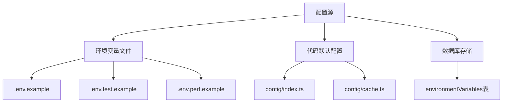
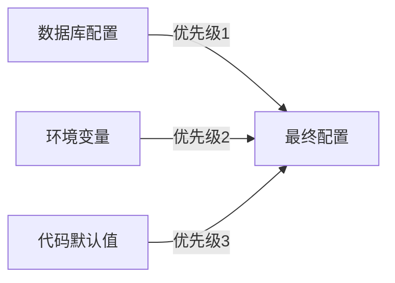
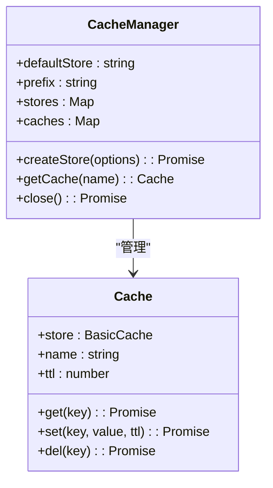
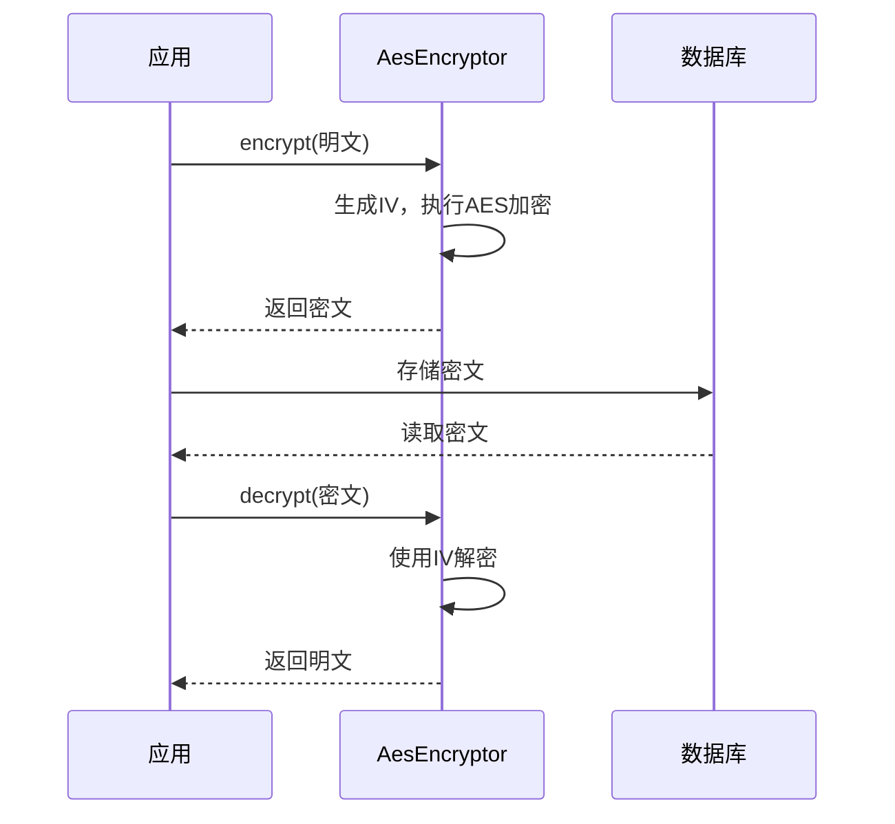
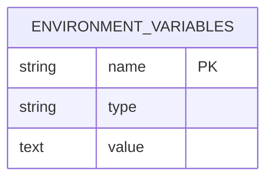
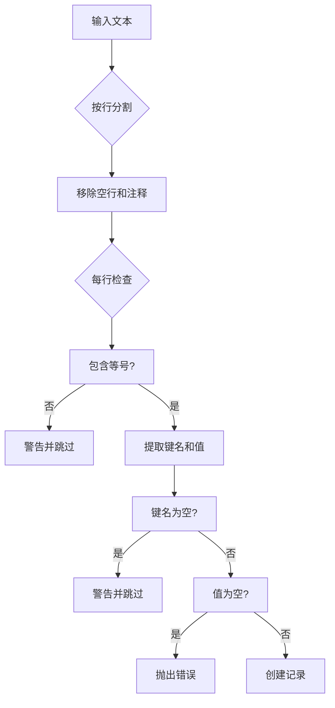

# 配置管理

<cite>
**本文档中引用的文件**  
- [.env.example](file://.env.example)
- [.env.test.example](file://.env.test.example)
- [.env.perf.example](file://.env.perf.example)
- [packages/core/app/src/config/index.ts](file://packages/core/app/src/config/index.ts)
- [packages/core/app/src/config/cache.ts](file://packages/core/app/src/config/cache.ts)
- [packages/core/database/src/helpers.ts](file://packages/core/database/src/helpers.ts)
- [packages/core/logger/src/config.ts](file://packages/core/logger/src/config.ts)
- [packages/core/server/src/application.ts](file://packages/core/server/src/application.ts)
- [packages/core/server/src/aes-encryptor.ts](file://packages/core/server/src/aes-encryptor.ts)
- [packages/plugins/@nocobase/plugin-environment-variables/src/server/plugin.ts](file://packages/plugins/@nocobase/plugin-environment-variables/src/server/plugin.ts)
- [packages/plugins/@nocobase/plugin-environment-variables/src/server/collections/environmentVariables.ts](file://packages/plugins/@nocobase/plugin-environment-variables/src/server/collections/environmentVariables.ts)
- [packages/core/database/src/fields/encryption-field/utils.ts](file://packages/core/database/src/fields/encryption-field/utils.ts)
</cite>

## 目录
1. [配置管理概述](#配置管理概述)
2. [配置文件结构与层次](#配置文件结构与层次)
3. [配置优先级规则](#配置优先级规则)
4. [核心配置选项详解](#核心配置选项详解)
5. [环境变量管理](#环境变量管理)
6. [配置热更新机制](#配置热更新机制)
7. [配置验证流程](#配置验证流程)
8. [多环境配置策略](#多环境配置策略)
9. [配置最佳实践](#配置最佳实践)
10. [常见配置错误与解决方案](#常见配置错误与解决方案)

## 配置管理概述

NocoBase采用分层配置管理系统，通过环境变量、配置文件和数据库存储相结合的方式实现灵活的配置管理。系统支持开发、测试和生产等多环境配置，提供安全的敏感信息存储机制，并实现了配置的热更新功能。

**Section sources**
- [.env.example](file://.env.example)
- [packages/core/app/src/config/index.ts](file://packages/core/app/src/config/index.ts)

## 配置文件结构与层次

NocoBase的配置系统采用多层结构，主要包括：

1. **环境变量文件**：`.env`系列文件作为基础配置源
2. **代码配置**：通过TypeScript模块定义默认配置
3. **数据库存储**：运行时动态配置存储在数据库中

系统提供了多个示例环境变量文件：
- `.env.example`：主应用配置示例
- `.env.test.example`：测试环境配置示例
- `.env.perf.example`：性能测试配置示例

这些文件定义了应用运行所需的各种配置参数，包括应用设置、数据库连接、缓存配置等。



**Diagram sources**
- [.env.example](file://.env.example)
- [.env.test.example](file://.env.test.example)
- [.env.perf.example](file://.env.perf.example)
- [packages/core/app/src/config/index.ts](file://packages/core/app/src/config/index.ts)

**Section sources**
- [.env.example](file://.env.example)
- [.env.test.example](file://.env.test.example)
- [.env.perf.example](file://.env.perf.example)

## 配置优先级规则

NocoBase配置系统遵循特定的优先级规则来确定最终配置值。当同一配置项在多个位置定义时，系统按照以下优先级顺序进行处理：

1. **数据库存储配置**：最高优先级，运行时动态配置
2. **环境变量**：中等优先级，文件或系统环境变量
3. **代码默认配置**：最低优先级，硬编码的默认值

这种优先级设计允许在不修改代码的情况下通过环境变量或数据库配置覆盖默认设置，同时确保系统始终有可用的默认配置。



**Diagram sources**
- [packages/core/app/src/config/index.ts](file://packages/core/app/src/config/index.ts)
- [packages/core/server/src/application.ts](file://packages/core/server/src/application.ts)

**Section sources**
- [packages/core/app/src/config/index.ts](file://packages/core/app/src/config/index.ts)
- [packages/core/server/src/application.ts](file://packages/core/server/src/application.ts)

## 核心配置选项详解

### 数据库连接参数

NocoBase支持多种数据库类型，主要配置参数包括：

- **DB_DIALECT**：数据库类型（postgres、mysql、mariadb、kingbase）
- **DB_HOST**：数据库主机地址
- **DB_PORT**：数据库端口
- **DB_DATABASE**：数据库名称
- **DB_USER**：用户名
- **DB_PASSWORD**：密码
- **DB_TABLE_PREFIX**：表前缀

数据库连接池配置：
- **DB_POOL_MAX**：最大连接数
- **DB_POOL_MIN**：最小连接数
- **DB_POOL_IDLE**：空闲超时时间（毫秒）
- **DB_POOL_ACQUIRE**：获取连接超时时间（毫秒）

**Section sources**
- [.env.example](file://.env.example)
- [packages/core/database/src/helpers.ts](file://packages/core/database/src/helpers.ts)

### 缓存设置

缓存系统支持内存和Redis两种存储方式：

- **CACHE_DEFAULT_STORE**：默认存储类型（memory或redis）
- **CACHE_MEMORY_MAX**：内存缓存最大条目数
- **CACHE_REDIS_URL**：Redis连接URL

系统通过`cache-manager`库实现缓存管理，支持灵活的存储配置和扩展。



**Diagram sources**
- [packages/core/app/src/config/cache.ts](file://packages/core/app/src/config/cache.ts)
- [packages/core/cache/src/cache-manager.ts](file://packages/core/cache/src/cache-manager.ts)

**Section sources**
- [packages/core/app/src/config/cache.ts](file://packages/core/app/src/config/cache.ts)

### 日志级别

日志系统提供灵活的配置选项：

- **LOGGER_TRANSPORT**：输出方式（console、file、dailyRotateFile）
- **LOGGER_LEVEL**：日志级别（error、warn、info、debug、trace）
- **LOGGER_BASE_PATH**：日志文件基础路径
- **LOGGER_FORMAT**：输出格式（console、json、logfmt、delimiter）

日志级别根据环境自动调整：开发环境默认为debug，生产环境默认为info。

**Section sources**
- [.env.example](file://.env.example)
- [packages/core/logger/src/config.ts](file://packages/core/logger/src/config.ts)

### 安全配置

安全相关配置包括：

- **APP_KEY**：应用密钥，用于加密和签名
- **APP_AES_SECRET_KEY**：AES加密密钥
- **ENCRYPTION_FIELD_KEY**：字段加密密钥（必须为32字符）

系统使用AES-256-CBC算法进行数据加密，确保敏感信息的安全存储。



**Diagram sources**
- [packages/core/server/src/aes-encryptor.ts](file://packages/core/server/src/aes-encryptor.ts)
- [packages/core/database/src/fields/encryption-field/utils.ts](file://packages/core/database/src/fields/encryption-field/utils.ts)

**Section sources**
- [packages/core/server/src/aes-encryptor.ts](file://packages/core/server/src/aes-encryptor.ts)
- [packages/core/database/src/fields/encryption-field/utils.ts](file://packages/core/database/src/fields/encryption-field/utils.ts)

### 性能调优参数

性能相关配置：

- **CLUSTER_MODE**：集群模式，支持PM2风格的集群部署
- **WORKER_MODE**：工作模式，控制服务器处理请求的类型
- **ENABLE_PERF_HOOKS**：启用性能分析钩子

这些参数允许根据部署环境和性能需求调整应用行为。

**Section sources**
- [.env.example](file://.env.example)
- [packages/core/server/src/application.ts](file://packages/core/server/src/application.ts)

## 环境变量管理

NocoBase提供专门的环境变量管理插件，支持在数据库中存储和管理环境变量。

### 环境变量存储结构

环境变量存储在`environmentVariables`数据库表中，包含以下字段：

- **name**：变量名称（主键）
- **type**：类型（default或secret）
- **value**：变量值



**Diagram sources**
- [packages/plugins/@nocobase/plugin-environment-variables/src/server/collections/environmentVariables.ts](file://packages/plugins/@nocobase/plugin-environment-variables/src/server/collections/environmentVariables.ts)

**Section sources**
- [packages/plugins/@nocobase/plugin-environment-variables/src/server/collections/environmentVariables.ts](file://packages/plugins/@nocobase/plugin-environment-variables/src/server/collections/environmentVariables.ts)

### 敏感信息处理

系统对类型为"secret"的环境变量进行AES加密存储：

1. 保存前：自动加密
2. 读取时：自动解密
3. API返回：不包含值（值为undefined）

这种机制确保敏感信息在数据库中的安全存储。

**Section sources**
- [packages/plugins/@nocobase/plugin-environment-variables/src/server/plugin.ts](file://packages/plugins/@nocobase/plugin-environment-variables/src/server/plugin.ts)

## 配置热更新机制

NocoBase实现了配置的热更新功能，无需重启应用即可应用配置变更。

### 热更新流程

```mermaid
flowchart TD
A[配置变更] --> B{变更类型}
B --> |环境变量| C[触发afterSave事件]
B --> |其他配置| D[手动触发reload]
C --> E[更新内存中的环境变量]
C --> F[发送同步消息]
D --> G[调用app.reload()]
E --> H[应用新配置]
F --> H
G --> H
H --> I[配置生效]
```

**Diagram sources**
- [packages/plugins/@nocobase/plugin-environment-variables/src/server/plugin.ts](file://packages/plugins/@nocobase/plugin-environment-variables/src/server/plugin.ts)
- [packages/core/server/src/application.ts](file://packages/core/server/src/application.ts)

**Section sources**
- [packages/plugins/@nocobase/plugin-environment-variables/src/server/plugin.ts](file://packages/plugins/@nocobase/plugin-environment-variables/src/server/plugin.ts)
- [packages/core/server/src/application.ts](file://packages/core/server/src/application.ts)

### 事件驱动更新

系统通过事件机制实现配置更新：

- `environmentVariables.afterSave`：保存环境变量后更新
- `environmentVariables.afterDestroy`：删除环境变量后更新
- `app:refresh`：手动触发应用刷新

**Section sources**
- [packages/plugins/@nocobase/plugin-environment-variables/src/server/plugin.ts](file://packages/plugins/@nocobase/plugin-environment-variables/src/server/plugin.ts)

## 配置验证流程

系统在配置处理过程中实施严格的验证机制。

### 环境变量格式验证

验证规则包括：
- 必须包含等号（=）
- 键名不能为空
- 值不能为空
- 键名符合命名规范



**Diagram sources**
- [packages/plugins/@nocobase/plugin-environment-variables/src/server/plugin.ts](file://packages/plugins/@nocobase/plugin-environment-variables/src/server/plugin.ts)

**Section sources**
- [packages/plugins/@nocobase/plugin-environment-variables/src/server/plugin.ts](file://packages/plugins/@nocobase/plugin-environment-variables/src/server/plugin.ts)

### 加密字段验证

对加密字段的密钥进行严格验证：
- 必须存在`ENCRYPTION_FIELD_KEY`环境变量
- 必须为字符串类型
- 长度必须为32个字符

**Section sources**
- [packages/core/database/src/fields/encryption-field/utils.ts](file://packages/core/database/src/fields/encryption-field/utils.ts)

## 多环境配置策略

NocoBase支持多种环境的配置管理策略。

### 环境分离方案

| 环境 | 配置文件 | 特点 |
|------|---------|------|
| 开发 | .env | 详细日志，内存缓存 |
| 测试 | .env.test | SQLite数据库，独立数据 |
| 生产 | .env.prod | Redis缓存，文件日志 |

### 环境变量加载顺序

1. 加载`.env`文件
2. 加载环境特定文件（如`.env.production`）
3. 加载系统环境变量
4. 加载数据库存储的配置

**Section sources**
- [.env.example](file://.env.example)
- [.env.test.example](file://.env.test.example)

## 配置最佳实践

### 安全实践

1. **敏感信息加密**：使用secret类型存储密码、密钥等
2. **最小权限原则**：配置只包含必要的权限
3. **定期轮换密钥**：定期更新加密密钥

### 性能实践

1. **合理设置缓存**：根据数据访问频率设置缓存策略
2. **优化数据库连接池**：根据负载调整连接池大小
3. **日志级别控制**：生产环境避免使用debug级别

### 可维护性实践

1. **配置文档化**：记录所有配置项的用途
2. **环境一致性**：保持各环境配置结构一致
3. **版本控制**：将配置文件纳入版本管理

**Section sources**
- [.env.example](file://.env.example)
- [packages/core/app/src/config/index.ts](file://packages/core/app/src/config/index.ts)

## 常见配置错误与解决方案

### 数据库连接失败

**症状**：应用启动时无法连接数据库
**原因**：
- 数据库地址或端口错误
- 用户名或密码不正确
- 数据库服务未启动

**解决方案**：
1. 检查`.env`文件中的数据库配置
2. 验证数据库服务状态
3. 测试网络连通性

### 缓存配置错误

**症状**：缓存功能异常或性能下降
**原因**：
- Redis连接URL格式错误
- 内存缓存大小设置不合理

**解决方案**：
1. 验证`CACHE_REDIS_URL`格式
2. 根据内存资源调整`CACHE_MEMORY_MAX`

### 加密密钥错误

**症状**：启动时报错"Invalid key length"
**原因**：
- `ENCRYPTION_FIELD_KEY`长度不为32字符
- 密钥文件损坏

**解决方案**：
1. 确保密钥为32个字符的字符串
2. 检查`storage/apps/{appName}/aes_key.dat`文件

**Section sources**
- [packages/core/server/src/aes-encryptor.ts](file://packages/core/server/src/aes-encryptor.ts)
- [packages/core/database/src/fields/encryption-field/utils.ts](file://packages/core/database/src/fields/encryption-field/utils.ts)