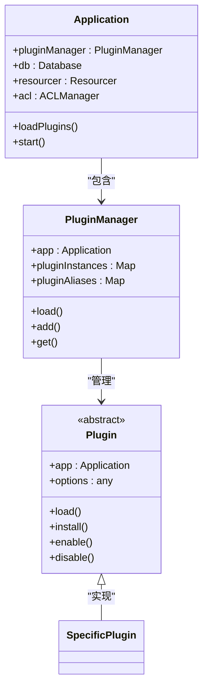
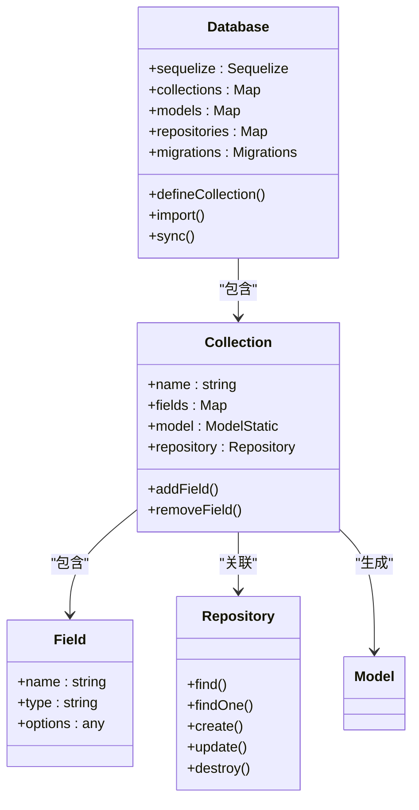
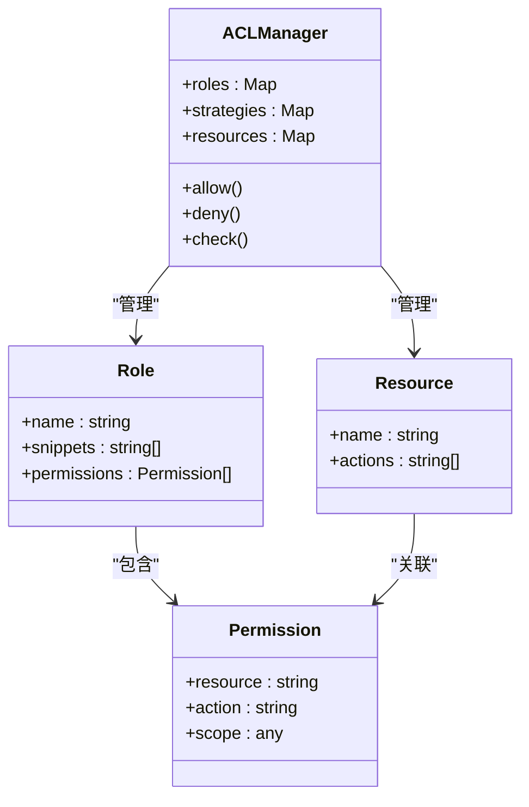
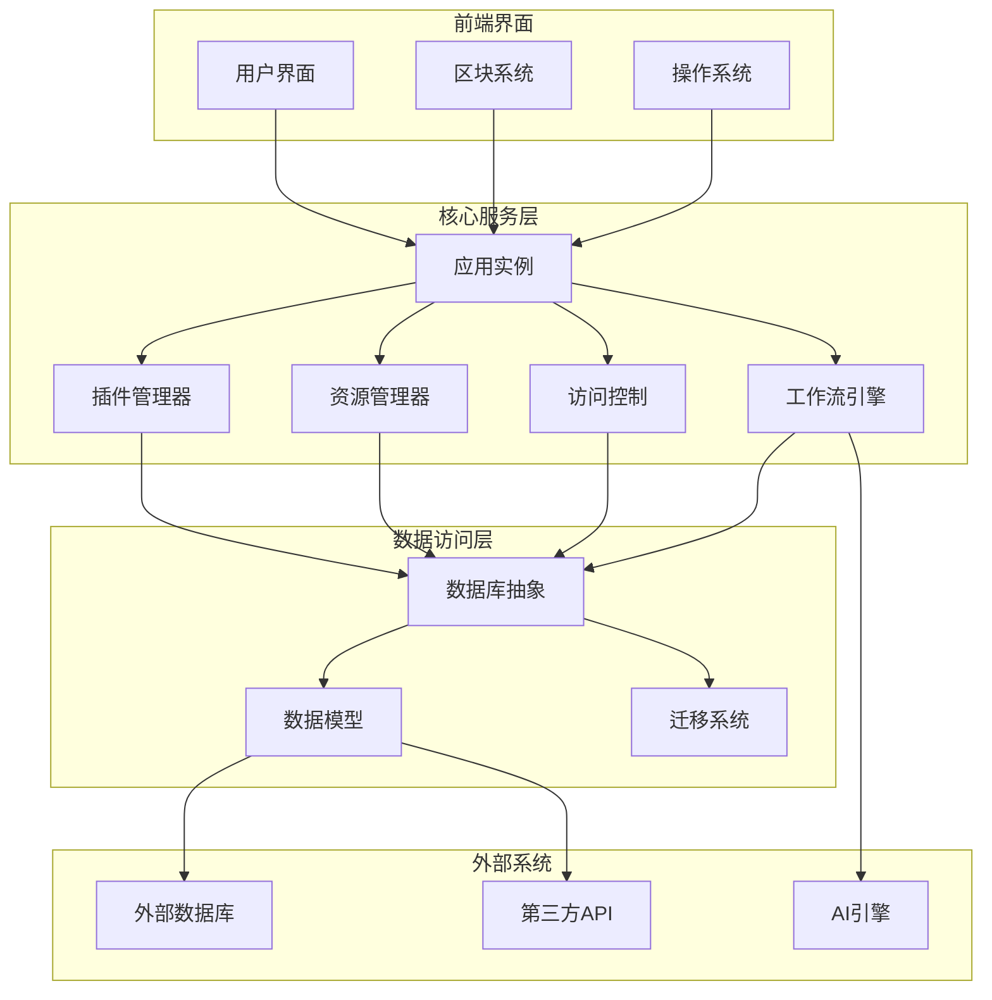

# 项目概述

<cite>
**本文档中引用的文件**  
- [README.md](file://README.md)
- [package.json](file://package.json)
- [packages/core/app/src/index.ts](file://packages/core/app/src/index.ts)
- [packages/core/server/src/index.ts](file://packages/core/server/src/index.ts)
- [packages/core/database/src/index.ts](file://packages/core/database/src/index.ts)
- [packages/core/server/src/application.ts](file://packages/core/server/src/application.ts)
- [packages/core/database/src/database.ts](file://packages/core/database/src/database.ts)
- [packages/core/acl/src/index.ts](file://packages/core/acl/src/index.ts)
- [packages/core/server/src/plugin-manager/plugin-manager.ts](file://packages/core/server/src/plugin-manager/plugin-manager.ts)
- [packages/core/server/src/plugin.ts](file://packages/core/server/src/plugin.ts)
</cite>

## 目录
1. [简介](#简介)
2. [项目结构](#项目结构)
3. [核心架构设计](#核心架构设计)
4. [微内核与插件化系统](#微内核与插件化系统)
5. [主要功能组件](#主要功能组件)
6. [数据模型驱动架构](#数据模型驱动架构)
7. [AI集成能力](#ai集成能力)
8. [工作流自动化](#工作流自动化)
9. [访问控制与权限管理](#访问控制与权限管理)
10. [系统启动流程](#系统启动流程)
11. [模块加载机制](#模块加载机制)
12. [运行时架构](#运行时架构)
13. [系统架构图](#系统架构图)

## 简介

NocoBase 是一个高度可扩展的AI驱动无代码平台，旨在为团队提供完全控制和无限扩展能力。该平台采用数据模型驱动的方法，将数据结构与用户界面完全解耦，支持主数据库、外部数据库和第三方API作为数据源。NocoBase的核心设计理念是"一切皆为插件"，通过微内核架构实现系统的高度可扩展性。

平台提供所见即所得的用户体验，用户可以在使用模式和配置模式之间一键切换。NocoBase支持三种安装方式：Docker安装（推荐）、create-nocobase-app CLI安装和Git源码安装，满足不同场景的需求。

**Section sources**
- [README.md](file://README.md#L10-L96)

## 项目结构

NocoBase项目采用monorepo结构，主要目录包括：
- **benchmark/**：性能基准测试相关代码
- **docker/**：Docker部署配置文件
- **examples/**：使用示例代码
- **locales/**：多语言本地化文件
- **packages/**：核心包和插件的主要存放位置
- **patches/**：依赖包补丁
- **scripts/**：构建和发布脚本
- **storage/**：存储目录配置

核心功能主要分布在`packages/core`目录下，包括app、server、database、acl等核心模块，而插件系统则位于`packages/plugins`目录中。

**Section sources**
- [package.json](file://package.json#L4-L7)

## 核心架构设计

NocoBase采用微内核架构设计，核心系统提供基础服务和扩展机制，所有功能特性都通过插件形式实现。这种架构设计使得系统具有极高的灵活性和可扩展性。

核心架构包含三个主要层次：
1. **核心服务层**：提供应用生命周期管理、插件管理、事件总线等基础服务
2. **数据库抽象层**：基于Sequelize实现的数据库访问层，支持多种数据库
3. **插件系统层**：可扩展的功能模块，所有业务功能都以插件形式存在

系统通过Koa框架构建HTTP服务，使用Sequelize作为ORM工具，Redis用于缓存和消息队列，实现了高性能的服务端架构。

**Section sources**
- [packages/core/server/src/index.ts](file://packages/core/server/src/index.ts#L10-L35)
- [packages/core/database/src/index.ts](file://packages/core/database/src/index.ts#L10-L66)

## 微内核与插件化系统

NocoBase的微内核架构是其可扩展性的核心。系统内核只包含最基本的运行时环境和扩展机制，所有功能特性都通过插件实现。

插件系统的关键特性包括：
- 所有功能都是插件，类似于WordPress的插件机制
- 插件安装后即可使用，无需额外配置
- 支持页面、区块、操作、API和数据源的扩展
- 插件可以相互依赖和扩展

插件管理器（PluginManager）负责插件的生命周期管理，包括加载、启用、禁用和卸载。每个插件都是一个独立的模块，可以定义自己的数据模型、API接口和用户界面。

**Diagram sources**
- [packages/core/server/src/application.ts](file://packages/core/server/src/application.ts#L111-L200)
- [packages/core/server/src/plugin-manager/plugin-manager.ts](file://packages/core/server/src/plugin-manager/plugin-manager.ts#L57-L200)
- [packages/core/server/src/plugin.ts](file://packages/core/server/src/plugin.ts#L43-L200)

## 主要功能组件

NocoBase提供了丰富的功能组件，主要包括数据模型驱动、AI集成、工作流自动化和访问控制等核心特性。

这些功能组件都以插件形式存在，通过统一的插件接口与核心系统集成。每个功能组件都可以独立开发、测试和部署，实现了功能的模块化和解耦。

系统通过Resourcer组件提供统一的API资源管理，通过ACL组件实现细粒度的权限控制，通过Workflow组件实现业务流程自动化。

**Section sources**
- [README.md](file://README.md#L37-L75)

## 数据模型驱动架构

NocoBase采用数据模型驱动的设计理念，将数据结构与用户界面完全解耦。这种设计使得同一数据模型可以有多种表现形式，满足不同的业务需求。

数据库抽象层提供了强大的数据建模能力，支持：
- 多种关系类型（一对一、一对多、多对多）
- 继承集合和视图集合
- 自定义字段类型和值解析器
- 复杂的查询条件和过滤器

数据模型层基于Sequelize构建，但进行了大量扩展和优化，提供了更丰富的功能和更好的性能。

**Diagram sources**
- [packages/core/database/src/database.ts](file://packages/core/database/src/database.ts#L134-L200)
- [packages/core/database/src/index.ts](file://packages/core/database/src/index.ts#L30-L34)

## AI集成能力

NocoBase将AI能力深度集成到业务系统中，不同于独立的AI演示，NocoBase允许将AI功能无缝嵌入到界面、工作流和数据上下文中。

AI集成的关键特性包括：
- 定义AI员工角色（如翻译、分析、研究、助手）
- 实现AI与人类的无缝协作
- 确保AI使用的安全性、透明性和可定制性

通过插件机制，AI功能可以作为独立的插件开发和部署，与其他系统组件协同工作。AI插件可以访问系统数据，参与业务流程，并提供智能化的决策支持。

**Section sources**
- [README.md](file://README.md#L49-L56)

## 工作流自动化

NocoBase的工作流自动化系统允许用户定义复杂的业务流程，实现任务的自动执行和数据的自动处理。

工作流系统支持多种类型的节点：
- 手动节点：需要人工干预
- 自动节点：系统自动执行
- 条件节点：根据条件分支
- 循环节点：重复执行
- 并行节点：同时执行多个分支

工作流引擎通过事件驱动的方式运行，可以响应系统事件、定时触发或手动启动。每个工作流实例都有自己的执行上下文，可以传递数据和状态。

**Section sources**
- [packages/core/server/src/application.ts](file://packages/core/server/src/application.ts#L25-L26)

## 访问控制与权限管理

NocoBase提供了强大的访问控制和权限管理功能，基于ACL（访问控制列表）机制实现细粒度的权限控制。

权限管理系统的关键特性包括：
- 基于角色的访问控制（RBAC）
- 策略驱动的权限管理
- 字段级别的权限控制
- 数据行级别的权限控制

ACL系统通过插件实现，与核心系统紧密集成。权限规则可以动态定义和修改，支持复杂的权限逻辑和条件判断。

**Diagram sources**
- [packages/core/acl/src/index.ts](file://packages/core/acl/src/index.ts#L10-L18)
- [packages/core/server/src/application.ts](file://packages/core/server/src/application.ts#L50-L51)

## 系统启动流程

NocoBase的系统启动流程遵循严格的初始化顺序，确保各个组件按正确顺序加载和配置。

启动流程主要包括以下步骤：
1. 运行插件静态导入
2. 获取应用配置
3. 初始化网关实例
4. 加载和启动插件
5. 同步数据库结构
6. 启动HTTP服务

启动过程由`Gateway.getInstance().run()`方法协调，确保所有依赖关系得到正确处理，系统状态一致。

**Section sources**
- [packages/core/app/src/index.ts](file://packages/core/app/src/index.ts#L13-L21)
- [packages/core/server/src/index.ts](file://packages/core/server/src/index.ts#L15-L18)

## 模块加载机制

NocoBase的模块加载机制基于插件管理器实现，支持动态加载和热更新。

插件加载的主要步骤包括：
1. 解析插件名称和路径
2. 加载插件模块
3. 创建插件实例
4. 调用插件的生命周期方法
5. 注册插件提供的功能

系统使用拓扑排序算法处理插件之间的依赖关系，确保插件按正确的顺序加载。插件可以声明对其他插件的依赖，加载器会自动解析和满足这些依赖。

**Section sources**
- [packages/core/server/src/plugin-manager/plugin-manager.ts](file://packages/core/server/src/plugin-manager/plugin-manager.ts#L57-L200)

## 运行时架构

NocoBase的运行时架构基于Koa框架构建，采用中间件模式处理HTTP请求。

运行时的主要组件包括：
- **应用实例**：管理整个应用的生命周期
- **插件管理器**：管理所有插件的加载和运行
- **数据库连接**：管理数据库连接和查询
- **资源管理器**：提供统一的API资源访问
- **ACL管理器**：处理权限验证
- **事件总线**：处理系统事件和消息

这些组件通过清晰的接口相互协作，形成了一个松耦合、高内聚的运行时环境。

**Section sources**
- [packages/core/server/src/application.ts](file://packages/core/server/src/application.ts#L111-L200)

## 系统架构图

**Diagram sources**
- [packages/core/server/src/application.ts](file://packages/core/server/src/application.ts#L111-L200)
- [packages/core/database/src/database.ts](file://packages/core/database/src/database.ts#L134-L200)
- [packages/core/server/src/plugin-manager/plugin-manager.ts](file://packages/core/server/src/plugin-manager/plugin-manager.ts#L57-L200)